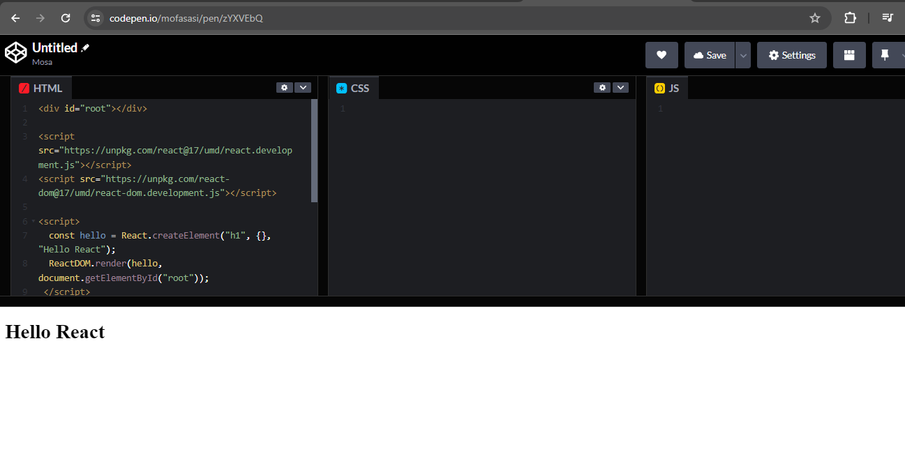
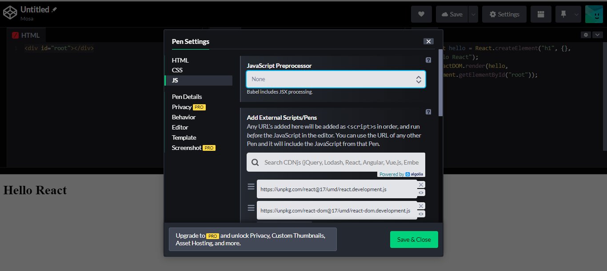
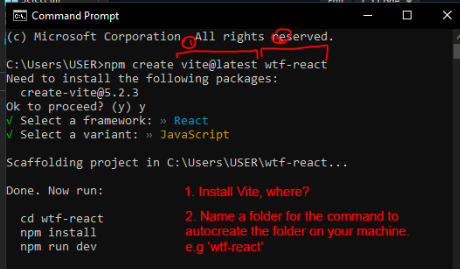
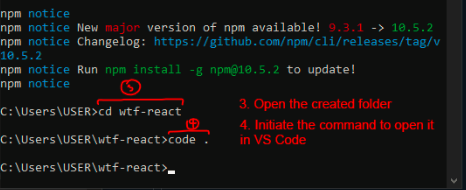
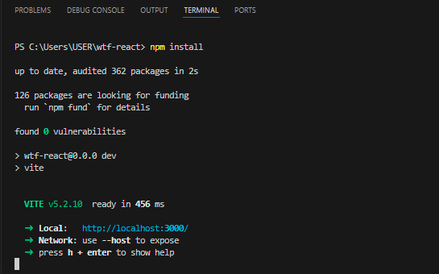
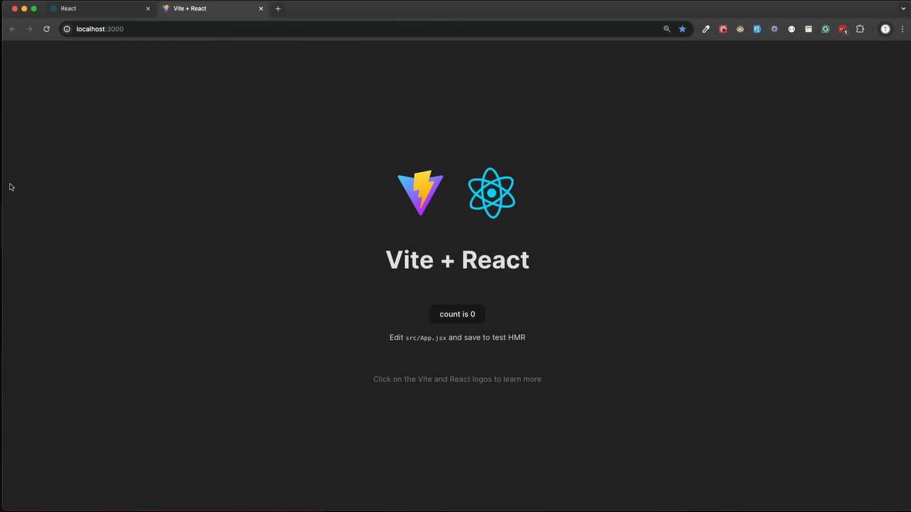

# WTF React minimalist tutorial: 1. Hello React

WTF React tutorial helps newcomers get started with React quickly.

**WTF Academy Community**: [Official Website wtf.academy](https://wtf.academy) | [Discord](https://discord.gg/5akcruXrsk)

**Twitter**: [@WTFAcademy_](https://twitter.com/WTFAcademy_) | Compiled by [@Mofasasi](https://twitter.com/mofasasi)

---

## What is React?

React is a JavaScript library designed for building user interfaces (UIs) in web applications. Developed by Facebook, React enables front-end developers to create interactive and dynamic web components, improving website performance and usability. With features like reusable UI components, one-way data flow, and virtual DOM, React facilitates efficient updates and reduces the complexity of managing state changes. Additionally, React can be integrated with popular back-end technologies like Node.js and various databases, making it a versatile choice for building modern, interactive web applications.

## History of React

The development of React started in 2010 by Jordan Walke, a software engineer at Facebook. His goal was to create a library that would simplify the process of building complex UIs by allowing developers to create reusable UI components. 

Walke's initial prototype, initially called "FaxJS," was inspired by Facebook's XHP, an HTML component library for PHP. As Facebook continued to grow and its web applications became increasingly complex, the need for a more efficient UI development tool became apparent.

In 2011, Facebook publicly released XHP, which demonstrated the potential benefits of using a component-based approach to building UIs. This served as a proof of concept for Walke's work on the JavaScript library, which would later become React.

In 2013, Facebook released the first version of React as an open-source project on GitHub. The library quickly gained popularity among developers due to its ease of use and efficient approach to managing complex UI updates. React's virtual DOM allowed developers to build dynamic UIs without directly manipulating the browser's actual DOM, resulting in faster and more efficient rendering.

## Why Learn React? 

Learning React opens up a wide range of opportunities for developers and provide a solid foundation for building modern, dynamic, and efficient user interfaces across various platforms and devices. Here are some key reasons to learn React:

1. Component Reusability: React encourages the development of modular and reusable UI components, which can save development time and promote a more organized codebase.
   
2. Efficient DOM Updates: React's virtual DOM allows developers to update components efficiently by only rendering the parts of the UI that have changed. This reduces DOM manipulation and leads to faster rendering and a smoother user experience.

3. Rich Ecosystem: React is supported by a vibrant community and an extensive ecosystem of libraries, tools, and frameworks. Developers can benefit from a wide range of resources, tutorials, and packages that can make development faster and more efficient.

4. High Demand: React is one of the most popular and in-demand skills for front-end developers. React developers are highly sought after by companies, leading to numerous job opportunities and potentially higher salaries.

# Development Tools

[VS Code](https://code.visualstudio.com/) is one of the most popular code editors today. Its configurability allows users to add features like JSX and TypeScript support, syntax highlighting, and autocomplete. 

Other popular React community editors include [WebStorm](https://www.jetbrains.com/webstorm/), [Sublime Text](https://www.sublimetext.com/), [Code Pen](https://codepen.io),  and [Vim](https://www.vim.org/), each offering unique features for efficient JavaScript development.

# Illustration with [Code Pen](https://codepen.io)

```
<div id="root"></div>

<script src="https://unpkg.com/react@17/umd/react.development.js"></script>
<script src="https://unpkg.com/react-dom@17/umd/react-dom.development.js"></script>

<script>
  const hello = React.createElement("h1", {}, "Hello React");
  ReactDOM.render(hello, document.getElementById("root"));
 </script>
```

 

We can make the code cleaner by adding the scripts in the JS settings on code pen, leaving us with 

```
HTML
<div id="root"></div>

JS
const hello = React.createElement("h1", {}, "Hello React");
  ReactDOM.render(hello, document.getElementById("root"));
```

 


As we advance, we will be using VS Code, but first, you need to install [Node.js](https://nodejs.org/zh-cn/download/) into your machine so that the following installation command can work. 

# Installation 

1. Open your terminal and install Vite in a folder on your machine. (note: `wtf-react` is the name of our folder here)
```
npm create vite@latest wtf-react
```

2. Select the `React` framework
3. Select the `JavaScript` variant



5. Open the new folder you just created with
```
cd wtf-react
```
5. Initiate the folder to open in VS Code with
```
code .
```


6. Open your VS Code terminal and install the dependencies
```
npm install
```
7. Open up local host to preview your code
```
npm run dev
```


Copy and paste the local host link in your browser, you should see a page like below:



# Summary

In the first lecture, we introduced what React is and why we should learn it. We also introduced the React development tools, wrote our first react code, "Hello React" in and online web editor, and then we set up our code environment in VS Code. Next, we continue our React journey!


 

