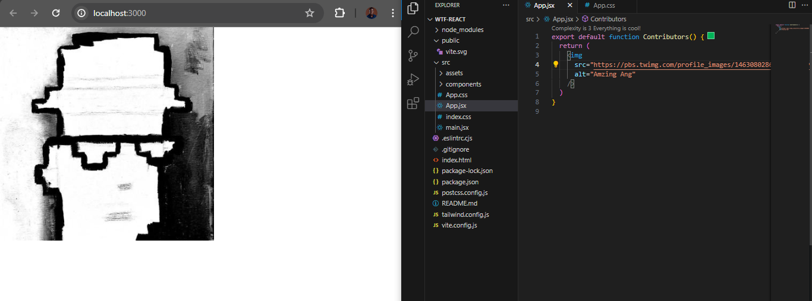
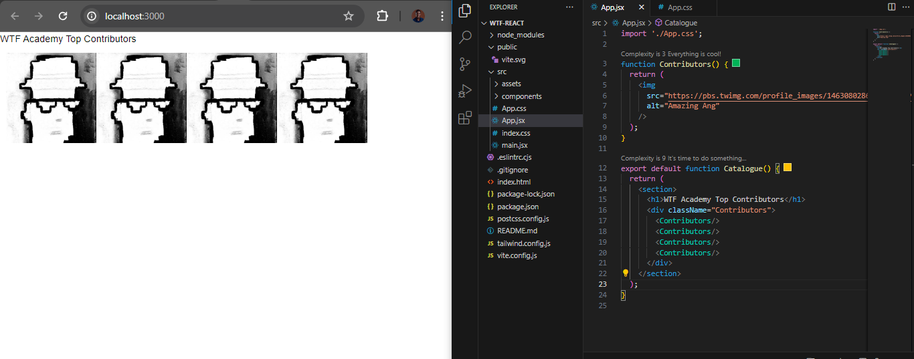

# WTF React minimalist tutorial: 2. Components

WTF React tutorial helps newcomers get started with React quickly.

**WTF Academy Community**: [Official Website wtf.academy](https://wtf.academy) | [Discord](https://discord.gg/5akcruXrsk)

**Twitter**: [@WTFAcademy_](https://twitter.com/WTFAcademy_) | Compiled by [@Mofasasi](https://twitter.com/mofasasi)

---

# What are Components?

In React, Components are reusable pieces of code that represent a part of a user interface (UI). Components are the building blocks of a React application, and they make it easier to create, manage, and maintain complex UIs by breaking them down into smaller, manageable pieces.

One of the primary advantages of using components in React is that they facilitate code reusability. By creating components for different parts of a UI, such as buttons, forms, or navigation bars, developers can reuse these components in multiple places throughout their application. This not only saves time and effort but also promotes consistency in the look and feel of the application.


# Breakdown of a Component

```javascript
function Contributors () {
  return (
    
  )
}
```

1. The `function` prefix allows us to name a component. For example, the above component is named `Contributors`. 

2. React's JSX syntax combines the simplicity of HTML-like markup with JavaScript, allowing you to create components easily, like an  tag with attributes.

```javascript
  return (
    
  )
```
 

# Reusing a Component

1. To reuse the above component, we use the `export default` prefix to identify the function. The prefix allows us to nest it or import it into another component with ease. 

In the example below, the `Contributors` component is reused in the `Catalogue` component with 4 `Contributors ` components. 

```javascript
function Contributors() {
  return (
    
  );
}

export default function Catalogue() {
  return (
    <section>
      <h1>WTF Academy Top Contributors</h1>
      <Contributors/>
      <Contributors/>
      <Contributors/>
      <Contributors/>
    </section>
  );
}
```
 

In other words, `Catalogue` is a parent component and `Contributors` is a child component. 

# Summary

In this lecture, we introduced Components, one of the core concepts of React. We looked at a breakdown of components and how we can reuse them. We also touched on how we can nest them in other components. 
