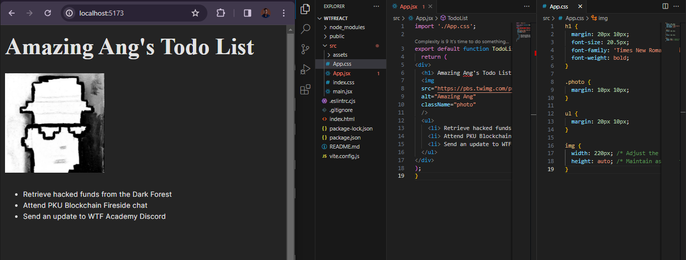

# WTF React minimalist tutorial: 3. Markup with JSX

WTF React tutorial helps newcomers get started with React quickly.

**WTF Academy Community**: [Official Website wtf.academy](https://wtf.academy) | [Discord](https://discord.gg/5akcruXrsk)

**Twitter**: [@WTFAcademy_](https://twitter.com/WTFAcademy_) | Compiled by [@Mofasasi](https://twitter.com/mofasasi)

---

# Markup with JSX

HTML is a markup language used to annotate and give structure to text or data in a way that computers can understand and process. `Tags` are used to define elements and their attributes. JSX is a syntax extension for Javascript that allows you to write HTML-like elements inside JavaScript code. So, basically, JSX is Javascript code written in the guise of HTML.

If you wonder why this is essential, it is because the web is built on HTML, styled in CSS and given responsivity with Javascript. So, HTML is the bedrock of the Web. It houses the content but as the Web developed and changed from being static to being dynamic with Javascript, more interactivity was required and this is why in React, both content (HTML) and interactivity (JavaScript) can be written in the same JSX file.

For example, below is a simple HTML code

```javascript
<h1> Amazing Ang's Todo List </h1>

<ul>
  <li> Retrieve hacked funds from the Dark Forest
  <li> Attend PKU Blockchain Fireside chat
  <li> Send an update to WTF Academy Discord
</ul>
```

To rewrite this in JSX, it becomes;

```javascript
import './App.css';

export default function TodoList() {
  return (
<div>
  <h1> Amazing Ang's Todo List </h1>
  
  <ul>
    <li> Retrieve hacked funds from the Dark Forest </li>
    <li> Attend PKU Blockchain Fireside chat</li>
    <li> Send an update to WTF Academy Discord</li>
  </ul>
</div>
);
}
```
 
