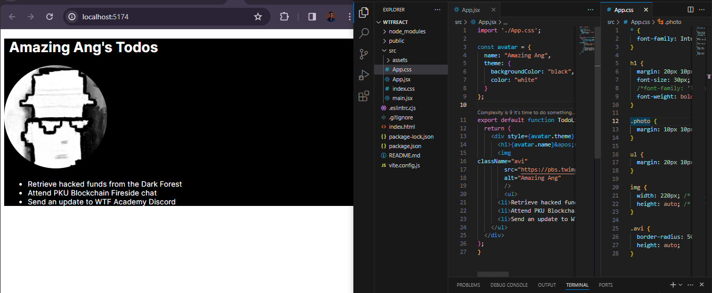

# WTF React minimalist tutorial: 4. JSX expressions

WTF React tutorial helps newcomers get started with React quickly.

**WTF Academy Community**: [Official Website wtf.academy](https://wtf.academy) | [Discord](https://discord.gg/5akcruXrsk)

**Twitter**: [@WTFAcademy_](https://twitter.com/WTFAcademy_) | Compiled by [@Mofasasi](https://twitter.com/mofasasi)

---

# JSX expressions

In React's JSX, you can use JavaScript code inside curly brackets {} to embed dynamic values or execute JavaScript logic within JSX elements. 

# 1. Passing strings with quotes

By now, you should be familiar with this because we've used this in previous lessons. This is simply when you pass a string attribute to JSX, putting it in single or double quotes like below:

```javascript
export default function Avi() {
  return (
    
  );
}
```
Here, we pass `"https://pbs.twimg.com/profile_images/1463080286665666564/ubE1IWCT_400x400.jpg"` and `"Amazing Ang"` as strings.

But what if we want to specify `src` or the `alt` text? We then have to declare them as variables and replace `" "` with `{ }` like below:

```javascript
import './App.css';
export default function Avi() {
  const avi = "https://pbs.twimg.com/profile_images/1463080286665666564/ubE1IWCT_400x400.jpg";
  const description = "Amazing Ang";
  return (
    
  );
}
```
 

Notice the difference between `className="avi"`, which specifies an `"avi"` CSS class name that makes the image round, and `src={avatar}` which reads the value of our variable `avi`. That is possible because curly brackets allow us to work with JavaScript within our markup!

# 2: Expressions with curly brackets 

Curly brackets allow us to pass JavaScript expressions in JSX. In the illustration below, we declare a variable `name` and then embed it with curly braces inside the `<h1></h1>` tag.

```javascript
export default function TodoList() {
  const name = 'Amazing Ang';
  return (
    <h1>{name}'s Todo List</h1>
);
}
```
 

The curly bracket expression allows Javascript logic, including function calls like `formatDate():`

```javascript
import './App.css';
const today = new Date();

function formatDate(date) {
  return new Intl.DateTimeFormat(
  'en-US',
{ weekday: 'long' }
).format(date);
}

export default function TodoList() {
  return (
  <h1> Todo List for { formatDate(today)}</h1>
);
}
```
 

Note: The two ways you can use a curly bracket are:
1. Inside an HTML tag like so: `<h1>{name}'s Todo List</h1>`
2. As attributes following the `=` sign like so: `alt={description}`

# 3: Expressions with double curly brackets 

Double curly brackets are used to pass objects in JSX but because objects are denoted with curly brackets, there is a need to wrap them in another pair of curly braces. 

An object looks like this: 
```javascript
{name: "Amazing Ang", contributions: 23}
```
In JSX, it will look like this 
```javascript
contributor= {{name: "Amazing Ang", contributions: 23}}
```
Also, the double curly brackets are often used when passing inline styles (CSS) as JavaScript objects within JSX elements. For instance:

```javascript
export default function TodoList() {
  return (
    <ul style={{
      backgroundColor: 'white',
      color: 'black'
    }}>
      <li>Retrieve hacked funds from the Dark Forest</li>
      <li>Attend PKU Blockchain Fireside chat</li>
      <li>Send an update to WTF Academy Discord</li>
    </ul>
  );
}
```
 

# What more?

You can also have an object inside another object, referencing them with curly brackets like so:

```javascript
import './App.css';

const avatar = {
  name: "Amazing Ang",
  theme: {
    backgroundColor: "black",
    color: "white"
  }
};

export default function TodoList () {
  return (
    <div style={avatar.theme}>
      <h1>{avatar.name}&apos;s Todos</h1>
      
        <ul>
      <li>Retrieve hacked funds from the Dark Forest</li>
      <li>Attend PKU Blockchain Fireside chat</li>
      <li>Send an update to WTF Academy Discord</li>
    </ul>
  </div>
);
}
```
 

In the above example, the `avatar` object contains a `name` string and a `theme` object. 

# Summary 

In this lecture, we examined JSX expressions; passing string in quotes, using single & double curly brackets, and we also examined how to nest an object inside another object. 

# Execrise

Take some time to break the code and see what works and why it works. If you run into a problem, that means you're doing something right. Keep at it!
