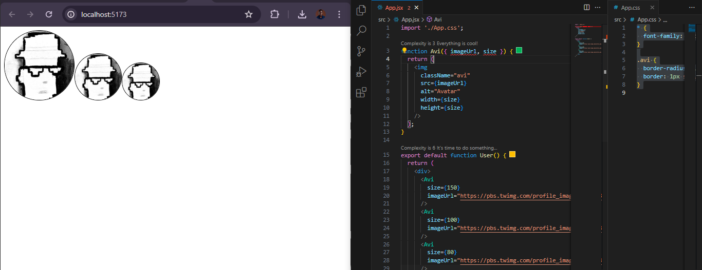
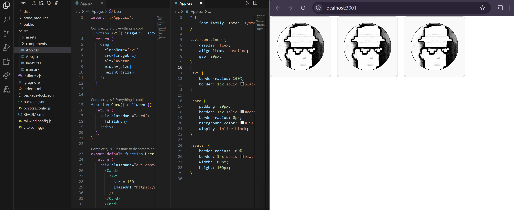

# WTF React minimalist tutorial: 5. Props

WTF React tutorial helps newcomers get started with React quickly.

**WTF Academy Community**: [Official Website wtf.academy](https://wtf.academy) | [Discord](https://discord.gg/5akcruXrsk)

**Twitter**: [@WTFAcademy_](https://twitter.com/WTFAcademy_) | Compiled by [@Mofasasi](https://twitter.com/mofasasi)

---

# Props

Props in React are properties passed from parent components to child components, allowing the child components to be customizable. They are the information that you pass to a JSX tag. For example, the `` tag contain the props `className`, `src`, `alt`:

```javascript
import './App.css';

function Avi({ imageUrl, size }) {
  return (
    
  );
}

export default function User() {
  return (
    <Avi/>
  );
}
```
There are defined props you can pass through the `` tag, [See here](https://www.w3.org/TR/html52/semantics-embedded-content.html#the-img-element).
However, you can also pass props to your own components and customize them. For example:

```javascript
export default function User() {
  return (
    <div className="avi-container">
      <Avi
        size={150}
        imageUrl="https://pbs.twimg.com/profile_images/1463080286665666564/ubE1IWCT_400x400.jpg"
      />
      <Avi
        size={100}
        imageUrl="https://pbs.twimg.com/profile_images/1463080286665666564/ubE1IWCT_400x400.jpg"
      />
      <Avi
        size={80}
        imageUrl="https://pbs.twimg.com/profile_images/1463080286665666564/ubE1IWCT_400x400.jpg"
      />
    </div>
  );
}
```

Think of Props like a switch you can adjust. They're similar to arguments you pass into functions. In React, components take props as their only input. So, when you define a component function, you're essentially creating a function that takes props as its argument.

 

# Passing JSX as children components

In React, when you place elements or components within a JSX tag, the parent component will automatically receive these nested elements or components as a special prop called `children`.
To illustrate, if you nest an `<Avi />` component inside a `<Card>` component, like so:

```javascript
import './App.css';

function Avi({ imageUrl, size }) {
  return (
    
  );
}

function Card({ children }) {
  return (
    <div className="card">
      {children}
    </div>
  );
}

export default function User() {
  return (
    <div className="avi-container">
      <Card>
        <Avi
          size={150}
          imageUrl="https://pbs.twimg.com/profile_images/1463080286665666564/ubE1IWCT_400x400.jpg"
        />
      </Card>
      <Card>
        <Avi
          size={150}
          imageUrl="https://pbs.twimg.com/profile_images/1463080286665666564/ubE1IWCT_400x400.jpg"
        />
      </Card>
      <Card>
        <Avi
          size={150}
          imageUrl="https://pbs.twimg.com/profile_images/1463080286665666564/ubE1IWCT_400x400.jpg"
        />
      </Card>
    </div>
  );
}
```
 

Here, the Avi component is passed as children to the Card component. The Card component can then render whatever is passed to it via children. This pattern is particularly useful for creating reusable UI components where the content can vary.

# Default Props
Sometimes, you might want to define default values for props, so that your component behaves correctly even if a particular prop isn't provided. This can be done using the defaultProps property.

```javascript
// Setting default props for the Avi component
Avi.defaultProps = {
  imageUrl: 'https://pbs.twimg.com/profile_images/1463080286665666564/ubE1IWCT_400x400.jpg',
  size: 100,
};

function Card({ children }) {
  return (
    <div className="card">
      {children}
    </div>
  );
}

export default function User() {
  return (
    <div className="avi-container">
      {/* Using Card with Avi without passing props, will use default props */}
      <Card>
        <Avi />
      </Card>
      {/* Using Card with Avi and passing custom size, but using default imageUrl */}
      <Card>
        <Avi size={120} />
      </Card>
      {/* Using Card with Avi and passing both custom size and imageUrl */}
      <Card>
        <Avi
          size={150}
          imageUrl="https://pbs.twimg.com/profile_images/1463080286665666564/ubE1IWCT_400x400.jpg"
        />
      </Card>
    </div>
  );
}
```

In the above example, if the name prop is not provided, the Greeting component will use 'Guest' as the default value.

 

# Prop Types
To make your components more robust, you can specify the types of props your component should receive using PropTypes. This helps in catching bugs early by ensuring that the right type of data is passed to your components.

```javascript
// Define PropTypes for the Avi component
Avi.propTypes = {
  imageUrl: PropTypes.string.isRequired,  // imageUrl must be a string and is required
  size: PropTypes.number.isRequired,      // size must be a number and is required
};

function Card({ children }) {
  return (
    <div className="card">
      {children}
    </div>
  );
}

// Define PropTypes for the Card component
Card.propTypes = {
  children: PropTypes.node.isRequired,   // children must be a valid React node and is required
};

export default function User() {
  return (
    <div className="avi-container">
      <Card>
        <Avi
          size={150}
          imageUrl="https://pbs.twimg.com/profile_images/1463080286665666564/ubE1IWCT_400x400.jpg"
        />
      </Card>
      <Card>
        <Avi
          size={120}
          imageUrl="https://pbs.twimg.com/profile_images/1463080286665666564/ubE1IWCT_400x400.jpg"
        />
      </Card>
      <Card>
        <Avi
          size={100}
          imageUrl="https://pbs.twimg.com/profile_images/1463080286665666564/ubE1IWCT_400x400.jpg"
        />
      </Card>
    </div>
  );
}
```
 

In this example, the Avatar component expects imageUrl to be a string and size to be a number. If these props are not provided or are of the wrong type, React will log a warning in the console.

# Summary 

Props are a fundamental concept in React that allows you to pass data from one component to another, making your components flexible and reusable. By understanding how to use props, children components, default values, and prop types, you can create robust and maintainable React applications.

Feel free to play around with the code, break the examples and see how changing the props affects the behaviour of your components!
