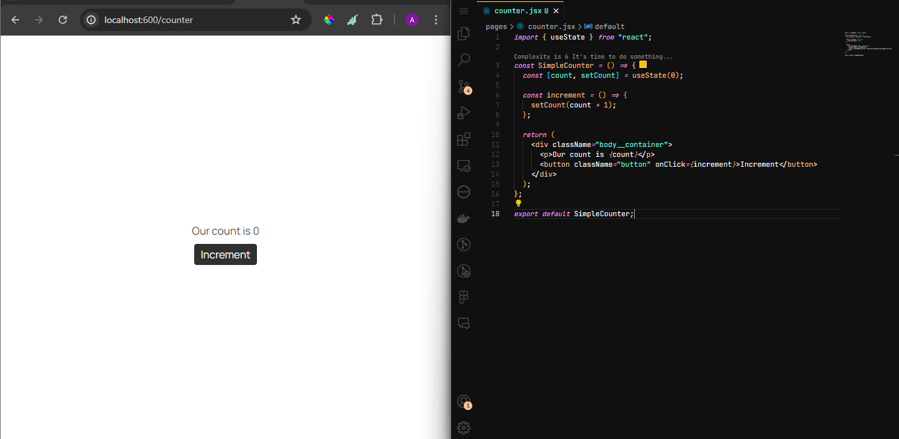
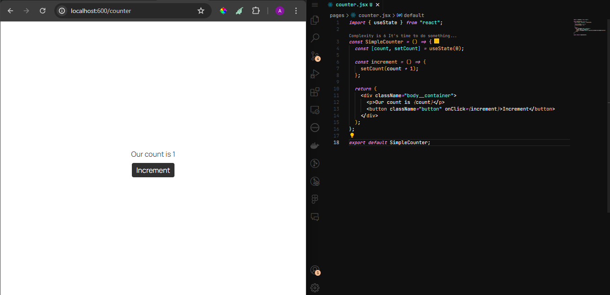
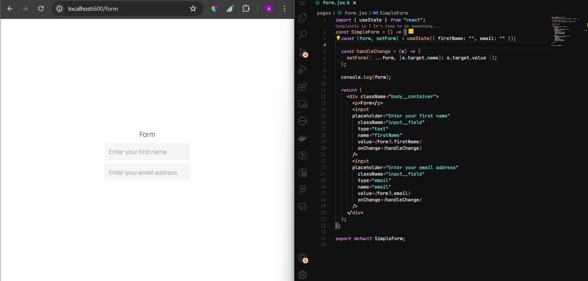
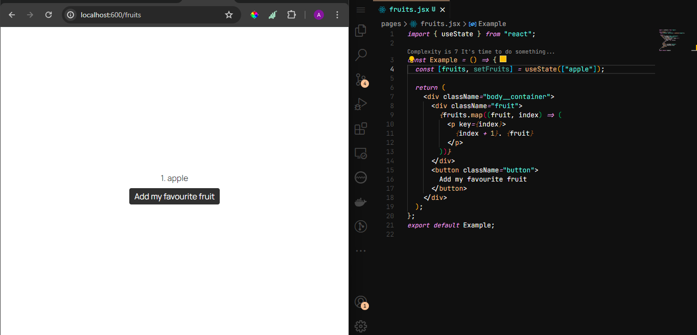
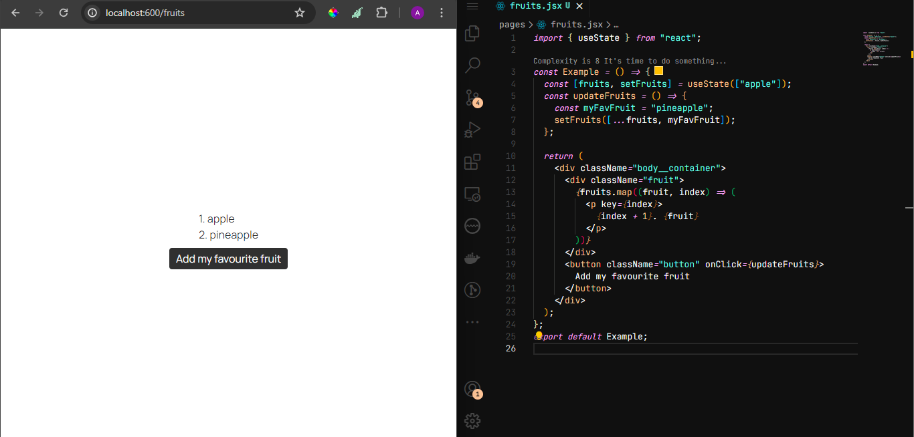
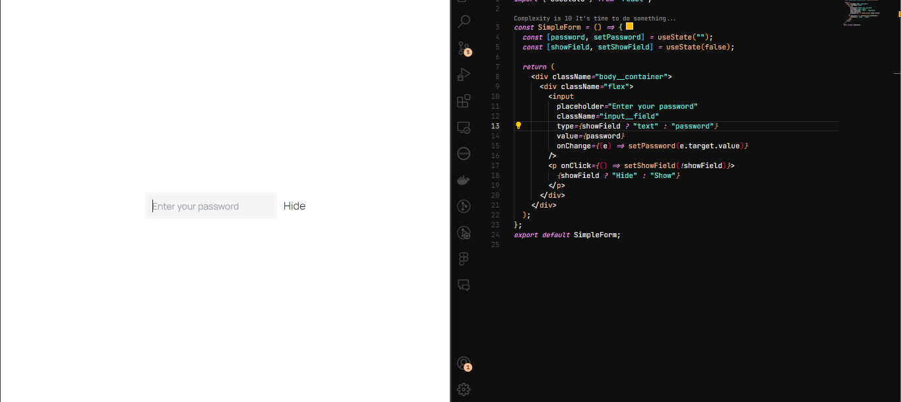
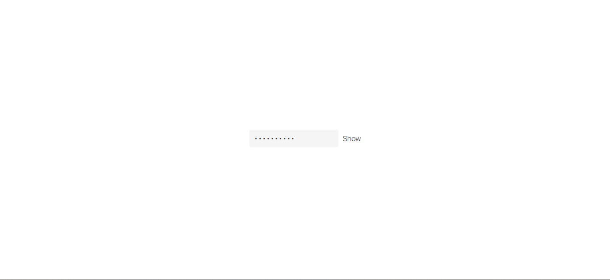
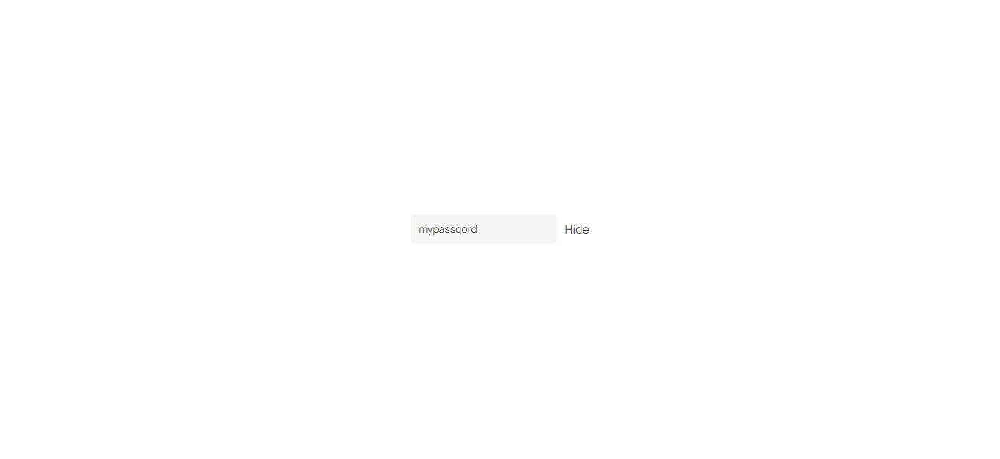

# WTF React minimalist tutorial: 5. React States

WTF React tutorial helps newcomers get started with React quickly.

**WTF Academy Community**: [Official Website wtf.academy](https://wtf.academy) | [Discord](https://discord.gg/5akcruXrsk)

**Twitter**: [@WTFAcademy\_](https://twitter.com/WTFAcademy_) | Compiled by [@adedigggba](https://twitter.com/adedigggba)

---

# React States

What is state in React? State is a way to manage and track dynamic data within a component. Or in simpler words, it is a special kind of data that components can maintain and change over time. To make it even more relatable, we have to liken it to vanilla javascript. In vanilla javascript, we usually use Variables which hold values that can be changed.
Take for instance, you have a count that you want to update from 0 to 1 in response to an event, maybe a click event. You'd typically say:

```html
<!DOCTYPE html>
<html lang="en">
  <head>
    <meta charset="UTF-8" />
    <meta name="viewport" content="width=device-width, initial-scale=1.0" />
    <title>Counter Example</title>
  </head>
  <body>
    <p id="countDisplay">You clicked 0 times</p>
    <button id="incrementButton">Click me</button>

    <script src="script.js"></script>
  </body>
</html>
```

```javascript
let count = 0;

const increment = () => {
  count = count + 1;
};
```

what the increment function does here is to increase count by 1 for every time it is fired. However, it does not change the UI. You then have to update the dom by doing something like just to simply update the UI.

```javascript
document.getElementById(
  "countDisplay"
).innerText = `You clicked ${count} times`;
document.getElementById("incrementButton").addEventListener("click", increment);
```

A react state saves the day by coming to the rescue such that the function can be called and the UI gets updated almost immediately.
It is important however to know that there is the concept of HOOKS in React. Hooks are special functions in React that allow you to use state and other React features in functional components. Before hooks, these features were only available in class components. Hooks make it easier to manage state and side effects in functional components, leading to cleaner and more maintainable code.
Here is how it works.

# 1. Importing `useState`

In the case of state, we use the useState hook which is the most popular of all the React hooks. Here's how to import it

```javascript
import { useState } from "react";
```

Note that since React version 17, you no longer need to import React from react in files that use JSX. This means you can directly use JSX without importing React explicitly. If you are using a < 17 version of React, please import React from 'react' alongside useState as follows:

```javascript
import React, { useState } from "react";
```

That is it, you have successfully imported useState! Great first step!

# 2. Initializing the state

We can initialize the state (using the count example from above) as follows;

```javascript
const [count, setCount] = useState(0);
```

Here, we are saying that the initial or default value of count is 0, count holds the current state value, while setCount is a function to update the state. Meaning that if we want to increment the value of count (0 as at now), we use setCount. Which brings us to the third step.

# 3. Updating the state

This is where we decide what happens when we do something -- the result of an action or event. For instance, if i want to increment the count by 1 everytime I click on an increment button, I am going to do the following;

```javascript
const increment = () => {
  setCount(count + 1);
};
```

Our codebase then looks like this (at this time);

```javascript
import { useState } from "react";

const SimpleCounter = () => {
  const [count, setCount] = useState(0);

  const increment = () => {
    setCount(count + 1);
  };

  return (
    <>
      <p>Our count is {count}</p>
      <button onClick={increment}>Increment</button>
    </>
  );
};

export default SimpleCounter;
```



Then we went ahead and clicked the button so we got:



For everytime we click on the increment button, we see immediately on the screen that the count increases. Using setCount ensures that React knows about the change and re-renders the component. When setCount is called, React automatically re-renders the component, updating the displayed count value in the <p> element.
Just like we update a number in this case, the state setter can manipulate a string, object, even arrays as well.

You might be wondering, how does this apply in an application that people use in their day-to-day activities, because in reality there is no one who wants to use an app that just makes them click on a button and then add a number to an existing number. This brings us to a more robust use of state.

Here we will learn how to use state to store a value of an input field, which I believe every app in this world has, whether during authentication or to collect users' data. Enough of the long talks, let us dive into it!

# 1. Import and initialize the state

Just like we did above, we have to first inport and initialize the state.

```javascript
import { useState } from "react";

import "./App.css";

const SimpleForm = () => {
  const [form, setForm] = useState({ firstName: "", email: "" });

  return <></>;
};

export default SimpleForm;
```

Here we made a state called form, which has a setter function called setForm, and the initial values of this form are store in an object, which has a firstName and an email.

# 2. Make a change handler

If you are coming from the knowledge of vanilla javascript (which I believe you are), you should know that handling forms can be a pain a pain, or well, maybe for me.
A change handler helps us manipulate our state better. See it in action here:

```javascript
import { useState } from "react";

import "./App.css";

const SimpleForm = () => {
  const [form, setForm] = useState({ firstName: "", email: "" });

  const handleChange = (e) => {
    setForm({ ...form, [e.target.name]: e.target.value });
  };

  console.log("the form values are", form);

  return (
    <div className="body__container">
      <p>Form</p>
      <input
        placeholder="Enter your first name"
        className="input__field"
        type="text"
        name="firstName"
        value={form?.firstName}
        onChange={handleChange}
      />
      <input
        placeholder="Enter your email address"
        className="input__field"
        type="email"
        name="email"
        value={form?.email}
        onChange={handleChange}
      />
    </div>
  );
};
export default SimpleForm;
```





Relaaaaaaaax! All we did here was:

1. write the change handler such that we are able to track each character that the user puts in using the input field.
   We did this by first spreading whatever we find inside of the form using the spread operator (...).
2. Then since we have more than one value to assign (firstName and email), we say, e.target.name which is defined in each case as 'firstName' and 'email' respectively, we need to make the key-value pair in this case to then be the name we have in our initial state ( firstName and email) to be the name we have in the input attribute NAME. This means that we are updating our form object this way:

```javascript
setForm({
  firstName: "*firstName characters go in here*",
  email: "*email characters go in here*",
});
```

_Name_ is an attribute of the input field that identifies the form control. It is used to match the input field with its corresponding property in the state object.

_value_ is the current value of the input field. In React, the value of the input field is typically controlled by state, meaning it is derived from the state variable and updated when the state changes, such that the initial value of the firstNAME is an empty string and as we press characters, the value gets updated using the setter function HANDLECHANGE and then as a result, we have an updated _value_ per time. It ensures that the input field always reflects the current state of the application.

_handleChange_ is an event handler function that is called whenever the value of the input field changes. It updates the state with the new value entered by the user. This function is passed to the onChange event of the input field, allowing it to respond to user input.

3. We went ahead to console our form to be sure that our code works.

It is worthy of note that when a React application reloads the page, the state resets to its default values because React is a client-side library. This means that all the JavaScript code, including the React components and their state, runs in the browser after being downloaded from the server. Therefore, on a page reload, React starts fresh, and all state information is lost unless intentionally persisted and rehydrated using techniques like browser storage, server-side rendering, or other state management libraries.

Lastly, I want us to touch on updating an array using state as well. This is quite simple and very straightforward.
Like we always do,

1. import and initialize the state (You should know how to do that yourself by now)
2. Make the initial value of the state to be an array, it could be an empty array or an array containing strings, numbers or objects. Here we will keep it simple and use a string.

```javascript
import { useState } from "react";

import "./App.css";

const Example = () => {
  const [fruits, setFruits] = useState(["apple"]);

  <div className="body__container">
    <div className="fruit">
      {fruits.map((fruit, index) => (
        <p>
          {index + 1}. {fruit}
        </p>
      ))}
    </div>
    <button className="button">Add my favourite fruit</button>
  </div>;
};
```



Here, I returned a list of all the fruits in the fruits array using the array method called MAP. By now, you should be familiar with map as you must be coming from the knowledge of vanilla javascript.

Now to update the fruits array, we are going to use our setter function which is setFruits in this case.

```javascript
import { useState } from "react";

import "./App.css";

const Example = () => {
  const [fruits, setFruits] = useState(["apple"]);
  const updateFruits = () => {
    const myFavFruit = "pineapple";
    setFruits([...fruits, myFavFruit]);
  };

  return (
    <div className="body__container">
      <div className="fruit">
        {fruits.map((fruit, index) => (
          <p>
            {index + 1}. {fruit}
          </p>
        ))}
      </div>
      <button className="button" onClick={updateFruits}>
        Add my favourite fruit
      </button>
    </div>
  );
};
export default Example;
```


All that happened here was that I updated the fruits list by adding my own favourite fruit to the list, using the updateFruits function which spreads the initial state of the fruits list and then added my own favourite to the end of the array.

One more example and surely you will have to use this a lot of times. It is setting boolean using a state and the perfect example of this is a password field where we get to toggle the password field to show or hide the input based on user's preference.

```javascript
import { useState } from "react";

import "./App.css";

const SimpleForm = () => {
  const [password, setPassword] = useState("");
  const [showField, setShowField] = useState(false);

  return (
    <div className="body__container">
      <div className="flex">
        <input
          placeholder="Enter your password"
          className="input__field"
          type={showField ? "text" : "password"}
          value={password}
          onChange={(e) => setPassword(e.target.value)}
        />
        <p onClick={() => setShowField(!showField)}>
          {showField ? "Hide" : "Show"}
        </p>
      </div>
    </div>
  );
};
export default SimpleForm;
```







In the above example, we had two states, one was for the password and the other one to track if the password is shown or not. Whenever we click on SHOW or HIDE, we manipulate the "showField" state to either show the password or not.
That is what the click action is doing, it takes the current state of showField, then set it to the opposite of it, meaning if it was false, the moment we click on it, it becoemes true -- and vice versa. Then we went on to render the SHOW or HIDE text dynamically depending on the current state of "showField". Lastly, to make sure that the field is hidden, there is the type attribute on input field that supports different values such as text, number, password, email and a few others.
We then said that whenever we want to keep it hidden, use type "password", otherwise use type "text". Type "text" shows the input field values while type "password" hides it from the user.
It is quite straightforward but to grasp it fully, you will have to play around with it and see how many scenarios you can come up with.

# Summary

In this lecture, we examined React state; the concept of React hooks, why we use react states, and we also learnt about how to use React states to store and update values within our component.

# Exercise

Initiate a state as an empty string, then go ahead to update the state value by setting it to your name. Simple right? Do the same for an object and an array and see how easy it is. Go ahead and get your hands dirty.
