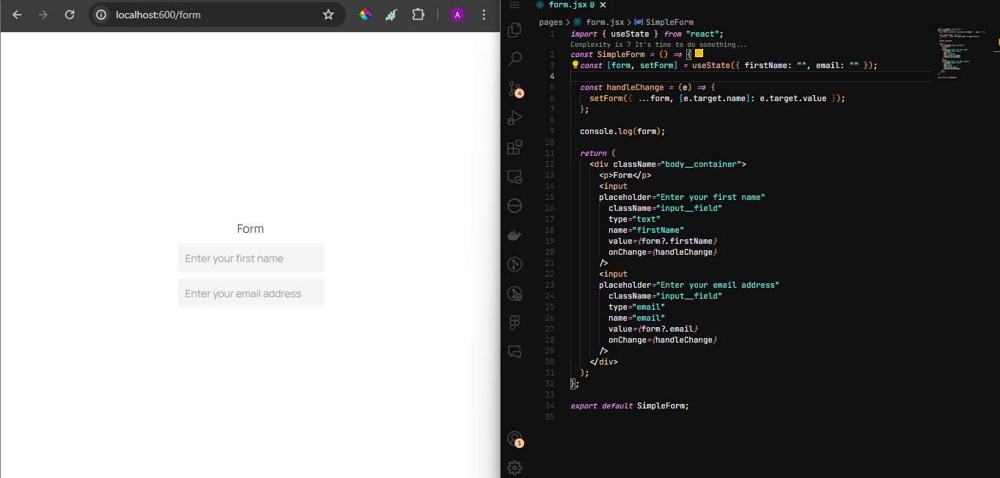
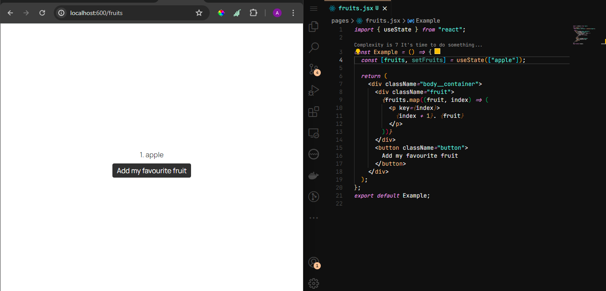
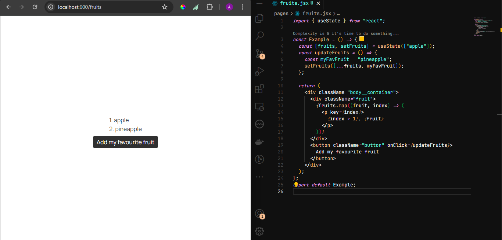
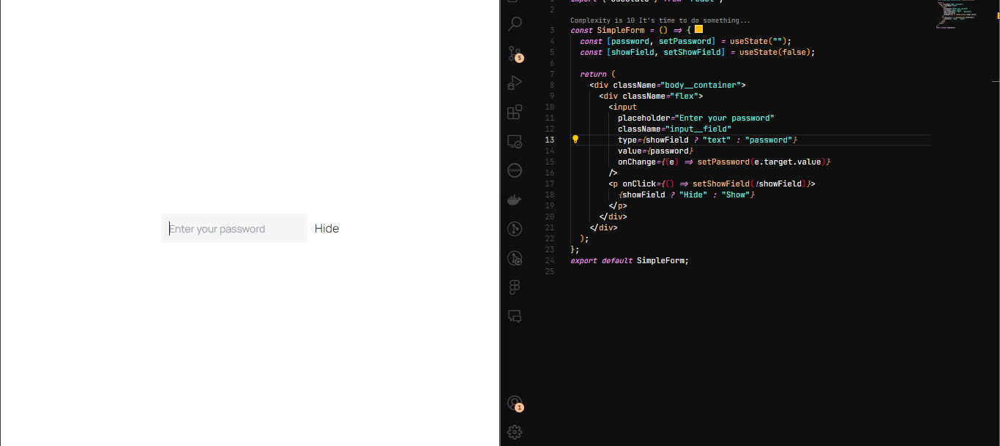
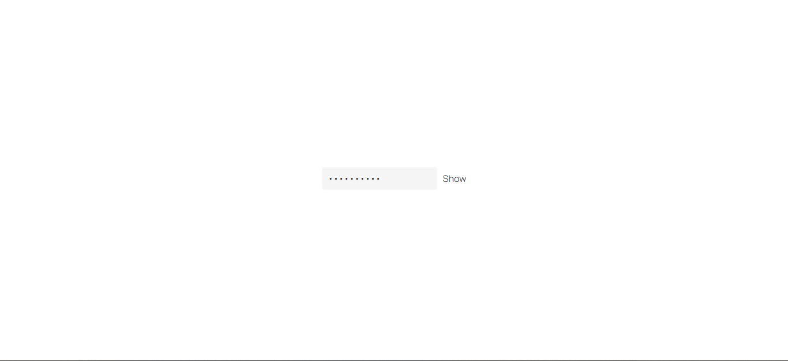

Here we will learn how to use state to store a value of an input field, which I believe every app in this world has, whether during authentication or to collect users' data. Enough of the long talks, let us dive into it!

# 1. Import and initialize the state

Just like we in the last chapter, we have to first import and initialize the state.

```javascript
import { useState } from "react";

import "./App.css";

const SimpleForm = () => {
  const [form, setForm] = useState({ firstName: "", email: "" });

  return <></>;
};

export default SimpleForm;
```

Here we made a state called "form", which has a setter function called "setForm", and the initial values of this form are stored in an object, which has a "firstName" and an "email".

# 2. Make a change handler

If you are coming from the knowledge of vanilla javascript (which I believe you are), you should know that handling forms can be a pain, or well, maybe for me.
A change handler helps us manipulate our state better. See it in action here:

```javascript
import { useState } from "react";

import "./App.css";

const SimpleForm = () => {
  const [form, setForm] = useState({ firstName: "", email: "" });

  const handleChange = (e) => {
    setForm({ ...form, [e.target.name]: e.target.value });
  };

  console.log("the form values are", form);

  return (
    <div className="body__container">
      <p>Form</p>
      <input
        placeholder="Enter your first name"
        className="input__field"
        type="text"
        name="firstName"
        value={form?.firstName}
        onChange={handleChange}
      />
      <input
        placeholder="Enter your email address"
        className="input__field"
        type="email"
        name="email"
        value={form?.email}
        onChange={handleChange}
      />
    </div>
  );
};
export default SimpleForm;
```




Relaaaaaaaax! All we did here was:

1. Write the change handler such that we are able to track each character that the user puts in using the input field. We did this by first spreading whatever we find inside of the form using the spread operator (...).
2. Then since we have more than one value to assign (firstName and email), we say, `e.target.name` which is defined in each case as 'firstName' and 'email' respectively, we need to make the key-value pair in this case to then be the name we have in our initial state ( firstName and email) to be the name we have in the input attribute NAME. This means that we are updating our form object this way:

```javascript
setForm({
  firstName: "*firstName characters go in here*",
  email: "*email characters go in here*",
});
```

_**Name**_ is an attribute of the input field that identifies the form control. It is used to match the input field with its corresponding property in the state object.

_**value**_ is the current value of the input field. In React, the value of the input field is typically controlled by state, meaning it is derived from the state variable and updated when the state changes, such that the initial value of the `firstNAME` is an empty string and as we press characters, the value gets updated using the setter function `HANDLECHANGE` and then as a result, we have an updated _value_ per time. It ensures that the input field always reflects the current state of the application.

_**handleChange**_ is an event handler function that is called whenever the value of the input field changes. It updates the state with the new value entered by the user. This function is passed to the onChange event of the input field, allowing it to respond to user input.

3. We went ahead to console our form to be sure that our code works.

It is worthy of note that when a React application reloads the page, the state resets to its default values because React is a client-side library. This means that all the JavaScript code, including the React components and their state, runs in the browser after being downloaded from the server. Therefore, on a page reload, React starts fresh, and all state information is lost unless intentionally persisted and rehydrated using techniques like browser storage, server-side rendering, or other state management libraries.

Lastly, I want us to touch on updating an array using state as well. This is quite simple and very straightforward.
Like we have been doing,

1. import and initialize the state (You should know how to do that yourself by now)
2. Make the initial value of the state to be an array, it could be an empty array or an array containing strings, numbers or objects. Here we will keep it simple and use a string.

```javascript
import { useState } from "react";

import "./App.css";

const Example = () => {
  const [fruits, setFruits] = useState(["apple"]);

  <div className="body__container">
    <div className="fruit">
      {fruits.map((fruit, index) => (
        <p>
          {index + 1}. {fruit}
        </p>
      ))}
    </div>
    <button className="button">Add my favourite fruit</button>
  </div>;
};
```



Here, I returned a list of all the fruits in the fruits array using the array method called MAP. By now, you should be familiar with map as you must be coming from the knowledge of vanilla javascript.

Now to update the fruits array, we are going to use our setter function which is setFruits in this case.

```javascript
import { useState } from "react";

import "./App.css";

const Example = () => {
  const [fruits, setFruits] = useState(["apple"]);
  const updateFruits = () => {
    const myFavFruit = "pineapple";
    setFruits([...fruits, myFavFruit]);
  };

  return (
    <div className="body__container">
      <div className="fruit">
        {fruits.map((fruit, index) => (
          <p>
            {index + 1}. {fruit}
          </p>
        ))}
      </div>
      <button className="button" onClick={updateFruits}>
        Add my favourite fruit
      </button>
    </div>
  );
};
export default Example;
```



All that happened here was that I updated the fruits list by adding my own favourite fruit to the list, using the updateFruits function which spreads the initial state of the fruits list and then added my own favourite to the end of the array.

One more example and surely you will have to use this a lot of times. It is setting boolean using a state and the perfect example of this is a password field where we get to toggle the password field to show or hide the input based on user's preference.

```javascript
import { useState } from "react";

import "./App.css";

const SimpleForm = () => {
  const [password, setPassword] = useState("");
  const [showField, setShowField] = useState(false);

  return (
    <div className="body__container">
      <div className="flex">
        <input
          placeholder="Enter your password"
          className="input__field"
          type={showField ? "text" : "password"}
          value={password}
          onChange={(e) => setPassword(e.target.value)}
        />
        <p onClick={() => setShowField(!showField)}>
          {showField ? "Hide" : "Show"}
        </p>
      </div>
    </div>
  );
};
export default SimpleForm;
```






In the above example, we had two states, one was for the password and the other one was to track whether the password is shown or not. Whenever we click on SHOW or HIDE, we manipulate the "showField" state to either show the password or not.
That is what the click action is doing, it takes the current state of showField, then set it to the opposite of it, meaning if it was false, the moment we click on it, it becoemes true -- and vice versa. Then we went on to render the SHOW or HIDE text dynamically depending on the current state of "showField".

Lastly, to make sure that the field is hidden, there is a type attribute on the input field that supports different values such as text, number, password, email and a few others.
We then said that whenever we want to keep it hidden, use type "password", otherwise use type "text". Type "text" shows the input field values while type "password" hides it from the user.
It is quite straightforward but to grasp it fully, you will have to play around with it and see how many scenarios you can come up with.

# Summary

In this lecture, we examined React state; the concept of React hooks, why we use react states, and we also learnt about how to use React states to store and update values within our component.

# Exercise

Initiate a state as an empty string, then go ahead to update the state value by setting it to your name. Simple right? Do the same for an object and an array and see how easy it is. Go ahead and get your hands dirty.
