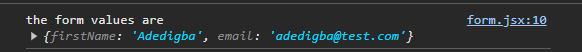

Here, we'll learn how to use state to store the value of an input field — something every app needs, whether for authentication or collecting user data. Let’s jump right in!

# 1. Import and initialize the state

As in the previous lecture, start by importing and initializing the state.

```javascript
import { useState } from "react";

import "./App.css";

const SimpleForm = () => {
  const [form, setForm] = useState({ firstName: "", email: "" });

  return <></>;
};

export default SimpleForm;
```

Here, we created a state called `form`, with a setter function named `setForm`. The initial values for this form are stored in an object, which includes `firstName` and `email`.

# 2. Create a Change Handler

If you’re familiar with vanilla JavaScript, you know that handling forms can be tricky (at least for me). A change handler simplifies managing state changes. Check it out in action here:

```javascript
import { useState } from "react";

import "./App.css";

const SimpleForm = () => {
  const [form, setForm] = useState({ firstName: "", email: "" });

  const handleChange = (e) => {
    setForm({ ...form, [e.target.name]: e.target.value });
  };

  console.log("the form values are", form);

  return (
    <div className="body__container">
      <p>Form</p>
      <input
        placeholder="Enter your first name"
        className="input__field"
        type="text"
        name="firstName"
        value={form?.firstName}
        onChange={handleChange}
      />
      <input
        placeholder="Enter your email address"
        className="input__field"
        type="email"
        name="email"
        value={form?.email}
        onChange={handleChange}
      />
    </div>
  );
};
export default SimpleForm;
```




Here’s what we just did:

1. We wrote a change handler to track each character the user types into the input field. We achieved this by spreading the current form values using the spread operator (`...`).

2. Since we have multiple values to manage (`firstName` and `email`), we use `e.target.name`, which corresponds to either `firstName` or `email`, as defined in the input field's `name` attribute. This way, we update our form object accordingly.

```javascript
setForm({
  firstName: "*firstName characters go in here*",
  email: "*email characters go in here*",
});
```

_**Name**_ is an attribute of the input field that identifies it, linking it to its corresponding property in the state object.

_**Value**_ represents the current content of the input field. In React, the input value is controlled by state, meaning it’s derived from the state variable and updates as the state changes. For example, the initial value of `firstName` starts as an empty string, and as you type, the value updates through the `handleChange` function, ensuring the input field always reflects the current state.

_**handleChange**_ is the event handler function triggered whenever the input field's value changes. It updates the state with the new user input and is assigned to the input field's `onChange` event, enabling real-time updates.

3. We then logged our form to ensure everything is working correctly.

Note that when a React application reloads, the state resets to its default values because React operates client-side. This means that after a page reload, React restarts with fresh state information unless it’s explicitly persisted and restored using methods like browser storage, server-side rendering, or state management libraries.

Finally, let’s cover updating an array using state. It’s straightforward:

1. Import and initialize the state (you should be familiar with this by now).
2. Set the initial value of the state to an array. This can be an empty array or one with strings, numbers, or objects. For simplicity, we’ll use a string array.

```javascript
import { useState } from "react";

import "./App.css";

const Example = () => {
  const [fruits, setFruits] = useState(["apple"]);

  <div className="body__container">
    <div className="fruit">
      {fruits.map((fruit, index) => (
        <p>
          {index + 1}. {fruit}
        </p>
      ))}
    </div>
    <button className="button">Add my favourite fruit</button>
  </div>;
};
```


Here, we used the `map` method to return a list of all the fruits in the `fruits` array. By now, you should be comfortable with `map` if you’re familiar with vanilla JavaScript.

To update the `fruits` array, we use the setter function `setFruits`.

```javascript
import { useState } from "react";

import "./App.css";

const Example = () => {
  const [fruits, setFruits] = useState(["apple"]);
  const updateFruits = () => {
    const myFavFruit = "pineapple";
    setFruits([...fruits, myFavFruit]);
  };

  return (
    <div className="body__container">
      <div className="fruit">
        {fruits.map((fruit, index) => (
          <p>
            {index + 1}. {fruit}
          </p>
        ))}
      </div>
      <button className="button" onClick={updateFruits}>
        Add my favourite fruit
      </button>
    </div>
  );
};
export default Example;
```


Here, we updated the `fruits` list by adding our favourite fruit to the array. We did this using the `updateFruits` function, which spreads the existing fruits and appends our favorite fruit to the end of the list.

Another common use of state is handling booleans, like toggling a password field to show or hide the input based on user preference. You’ll find yourself using this technique frequently.

```javascript
import { useState } from "react";

import "./App.css";

const SimpleForm = () => {
  const [password, setPassword] = useState("");
  const [showField, setShowField] = useState(false);

  return (
    <div className="body__container">
      <div className="flex">
        <input
          placeholder="Enter your password"
          className="input__field"
          type={showField ? "text" : "password"}
          value={password}
          onChange={(e) => setPassword(e.target.value)}
        />
        <p onClick={() => setShowField(!showField)}>
          {showField ? "Hide" : "Show"}
        </p>
      </div>
    </div>
  );
};
export default SimpleForm;
```


In the example above, we used two states: one for the password value and another for tracking whether the password is visible. When you click "SHOW" or "HIDE," the `showField` state toggles between `true` and `false`. This click action updates the state to the opposite value, and then we render "SHOW" or "HIDE" based on the current `showField` state.

To manage visibility, the input field's `type` attribute is set to either "password" or "text". `type="password"` hides the input value, while `type="text"` shows it. This setup allows you to toggle between showing and hiding the password.

It's a straightforward concept, but you'll get a better grasp by experimenting with different scenarios.

# Summary

In this lecture, we explored how to use state to manage and update complex values and learned practical applications of the state hook.

# Exercise

Create a form with fields for first name, last name, email, password, and a password confirmation field. Experiment with it to see how it works. Then, set up a list where you can add multiple items—try adding two or even three items to see how it functions.
