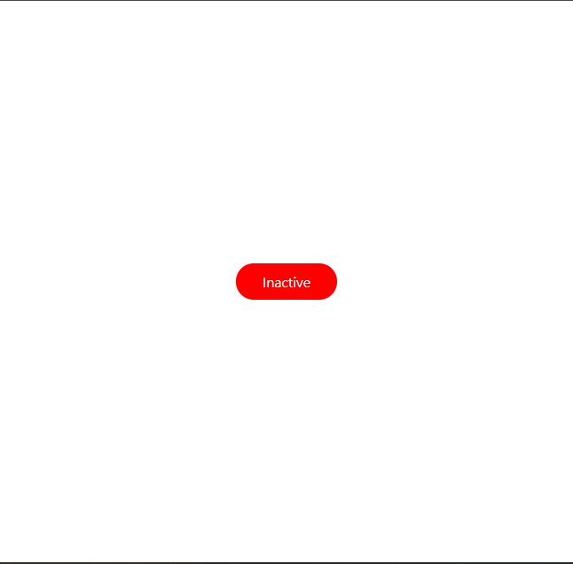
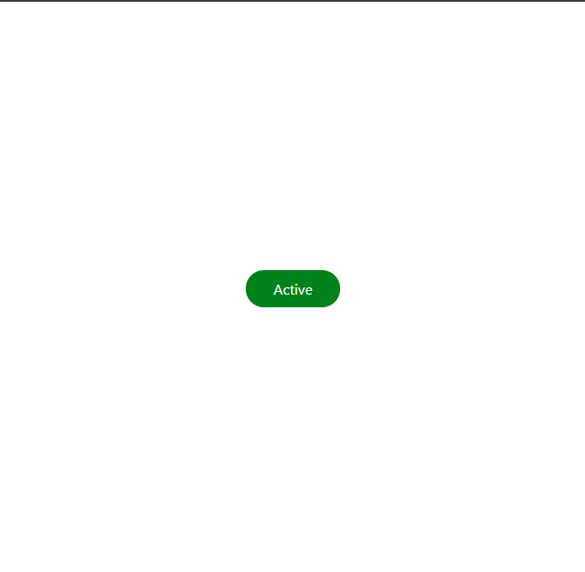

# WTF React minimalist tutorial: 8. Conditional Rendering

WTF React tutorial helps newcomers get started with React quickly.

**WTF Academy Community**: [Official Website wtf.academy](https://wtf.academy) | [Discord](https://discord.gg/5akcruXrsk)

**Twitter**: [@WTFAcademy\_](https://twitter.com/WTFAcademy_) | Compiled by [@mofasasi](https://twitter.com/mofasasi)

---

# Conditional Rendering

Conditional rendering is a technique that lets you display different content based on specific conditions. It's similar to using if-else statements in regular JavaScript, but it's applied within your JSX. There are several ways to conditionally render items in your user interface, including:

# 1. Using the Ternary Operator

The ternary operator is another way to write simple if-else statements. Here's how it works:

```javascript
const Greeting = () => {
  const isLoggedIn = true;

  return (
    <div>{isLoggedIn ? <h1>Welcome back!</h1> : <h1>Please sign in.</h1>}</div>
  );
};

export default Greeting;
```

In this example, we're checking if `isLoggedIn` is true. If it is, we display "Welcome back!"; otherwise, we show "Please sign in." The logic works like this: the element that follows the "?" is displayed when the condition is true, while the element after the ":" is shown when the condition is false. So, you can read it as: if `isLoggedIn` is true (?), show "Welcome back!"; but if it's false (":"), show "Please sign in."

# 2. Using the Logical AND (&&) Operator

For simpler conditions where you want to render something or nothing—meaning you either render an element or leave the space empty—you can use the `&&` operator. Here's how it works:

```javascript
const Notification = () => {
  const hasNewMessages = true;
  return <div>{hasNewMessages && <p>You have new messages!</p>}</div>;
};

export default Notification;
```

This will only render the paragraph if hasNewMessages is true, otherwise, there will be nothing to show on the notification screen.

# 3. Conditional Rendering with State

Let's combine what we learned about state with conditional rendering:

```javascript
import { useState } from "react";
import "./App.css";

const ToggleButton = () => {
  const [isOn, setIsOn] = useState(false);

  const toggle = () => {
    setIsOn(!isOn);
  };

  return (
    <div className="container">
      <button onClick={toggle}>
        {isOn ? "Turn Off" : "Turn On"} the light
      </button>
      {isOn && <p>The light is currently ON!</p>}
    </div>
  );
};

export default ToggleButton;
```

 

In this example, we used state to track whether the button is on or off and then conditionally rendered both the button text and an additional message.

Another great use case for conditional rendering is when fetching data from an API. You need to handle the loading state, error state, and then render the original component once the data is successfully retrieved. Conditional rendering can also be applied to `className` attributes, allowing you to dynamically apply a class based on certain conditions. Here's how that might look:

```javascript
import React, { useState } from "react";
import "./App.css";

const ConditionalClassExample = () => {
  const [isActive, setIsActive] = useState(false);

  const toggleActive = () => {
    setIsActive(!isActive);
  };

  return (
    <div className="container">
      <p
        className={`default ${isActive ? " active_bg" : "inactive_bg"}`}
        onClick={toggleActive}
      >
        {isActive ? "Active" : "Inactive"}
      </p>
    </div>
  );
};

export default ConditionalClassExample;
```

 

In the example above, the className `"default"` serves as the foundation, always present regardless of the `isActive` state. It provides the base styling that remains constant. The conditional part `${isActive ? "active_bg" : "inactive_bg"}` acts as a dynamic modifier. It checks the `isActive` state and applies either `"active_bg"` or `"inactive_bg"` accordingly. This conditional class complements the base `"default"` class, allowing us to apply state-specific styling.

# Summary

In this lecture, we covered various methods of conditional rendering in React, including using the ternary operator, the logical AND operator, and combining conditional rendering with state. Remember, in real projects (starting with the exercise), you might deal with more complex scenarios. For instance, after fetching data from an endpoint, you may need to check if a condition is true or false and then render your components accordingly.

# Exercise

Create a component that displays a list of items. Use conditional rendering to show the message "The list is empty" when there are no items and display the actual list when there are items. Use the `useState` hook to manage the list of items.
