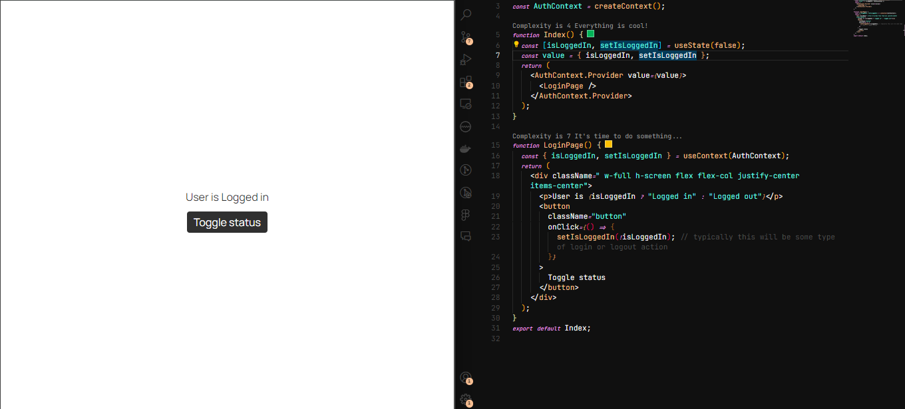

# WTF React minimalist tutorial: 9. React Hooks

WTF React tutorial helps newcomers get started with React quickly.

**WTF Academy Community**: [Official Website wtf.academy](https://wtf.academy) | [Discord](https://discord.gg/5akcruXrsk)

**Twitter**: [@WTFAcademy\_](https://twitter.com/WTFAcademy_) | Compiled by [@Mofasasi](https://twitter.com/mofasasi)

---

# What are Hooks?

React Hooks are functions that allow you to use state and other React features in functional components. They are like special tools that simplify adding features to your components without needing complex class components. With Hooks, you can create awesome components using just functions! If you’ve worked with classes before, you know they can sometimes be cumbersome, but with Hooks, everything becomes more streamlined—so why not give them a try?

Some popular React Hooks include `useState`, `useEffect`, `useContext`, `useReducer`, `useMemo`, and `useCallback`. Notice how all Hooks begin with the prefix "use." This is a convention in React, and when creating your own custom Hooks (which you can do), make sure to start with "use" to indicate that they follow the rules of Hooks.

# 1. useEffect

The `useEffect` Hook in React is a powerful tool that lets you perform side effects in functional components. Side effects refer to any operations that affect something outside the scope of the component, such as fetching data, updating the DOM, or setting up subscriptions or timers.

At its most basic level, the syntax looks like this:

```javascript
import { useEffect } from 'react';

function MyComponent() {
  useEffect(() => {
    // Side effect code goes here
  }, [dependencies]);
  return (
    // JSX for rendering the component
  );
}
```

Now, let’s break down what each term above means:

- **Side Effect**: A side effect is the consequence of an action. In the context of `useEffect`, it means that any code inside the `useEffect` hook runs as a result of something happening. A classic example is fetching data from the backend when you navigate to a specific page in your application. This data fetching is typically placed inside a `useEffect` hook, which only runs when you visit that page. We’ll see this in action shortly.

- **Dependencies**: The dependencies argument in `useEffect` is an array that lets you control when the effect should run. It specifies the values that the effect relies on. Here’s a simple explanation of how dependencies work in `useEffect`:
  1. If you don’t provide a dependencies array, the effect will run after every render.
  2. If you provide an empty array `[]`, the effect will run once, right after the initial render.
  3. If you include values in the dependencies array (e.g., `[prop1, state1]`), the effect will run after the initial render and whenever any of those dependencies change in subsequent renders.

Keep these points in mind as we'll now see how they practically work.

```javascript
import { useState, useEffect } from "react";
import axios from "axios";

function Users() {
  const [user, setUser] = useState(null);
  const [error, setError] = useState(null);

  useEffect(() => {
    const fetchUser = async () => {
      try {
        const response = await axios.get(`https://api.example.com/users`);
        setUser(response.data);
      } catch (error) {
        setError(error);
      }
    };
    fetchUser();
  }, []); //note the empty dependency here

  return (
    <div>
      <h1>{user.name}</h1>
      <p>{user.email}</p>
    </div>
  );
}
export default Users;
```

What we did here was simply fetch data from the users' endpoint when the users' page is loaded and displaying it to the client. Since we used an empty dependency array, this effect will only run once when the page loads. If we had passed in an array of dependencies, the effect would run every time any of those dependencies change. For example:

```javascript
function User({ id }) {
  const [user, setUser] = useState(null);
  const [error, setError] = useState(null);

  useEffect(() => {
    const fetchUser = async () => {
      try {
        const response = await axios.get(`https://api.example.com/users/${id}`);
        setUser(response.data);
      } catch (error) {
        setError(error);
      }
    };
    fetchUser();
  }, [id]); //Notice the dependency here
  return <>return your jsx here</>;
}
export default User;
```

Here, each time the `id` (which is passed as a prop) changes, the endpoint to fetch the data will be called, updating the user with the `setUser` setter or setting an error with `setError` if something goes wrong. Keep in mind that this effect will also run the first time the page loads, and then again whenever the `id` changes. It’s not limited to running only when the `id` changes.

You might wonder, what if we have more than one dependency — meaning we want it to run based on two or more actions? That’s entirely possible. In that case, we would list all the dependencies in an array, separated by commas. It would look something like this:

```javascript
useEffect(() => {
  const fetchUser = async () => {
    try {
      const response = await axios.get(`https://api.example.com/users/${id}`);
      setUser(response.data);
    } catch (error) {
      setError(error);
    }
  };
  fetchUser();
}, [id, something, anotherThing, anotherExtraThing]);
```

Before we move on from `useEffect`, there's an important concept to cover: the cleanup function. The cleanup function in React’s `useEffect` hook is used to stop side effects that are no longer needed before a component is unmounted. This helps prevent memory leaks and ensures that the component’s behaviour remains consistent and predictable. Here's an example of how to use the cleanup function:

```javascript
import { useState, useEffect } from "react";

function Timer() {
  const [count, setCount] = useState(0);

  useEffect(() => {
    const interval = setInterval(() => {
      setCount(count + 1);
    }, 1000);

    //here is the cleanup function
    return () => {
      clearInterval(interval);
    };
  }, [count]);

  return (
    <div>
      <h2>Timer</h2>
      <p>The count is: {count}</p>
    </div>
  );
}
```

In simpler terms, the cleanup function tells the `useEffect` hook to "turn off" the timer when it's no longer needed, preventing unnecessary renders and memory leaks. In the example above, if you set up an interval in the `useEffect` hook without providing a cleanup function, the interval would continue to run even after the component has been unmounted. This means the callback function defined in the interval would keep getting called, even though the component is no longer visible on the screen.

Each time the interval callback is called, it would try to update the component's state (in this case, the `count` state). However, since the component is already unmounted, React wouldn't be able to update the UI. Instead, React would attempt to "re-render" the component, even though it's not visible anymore. These unnecessary re-renders can lead to performance issues because React has to handle these redundant updates. It's similar to cleaning up your dishes before using them again—this is exactly what the cleanup function does.

# 2. `useReducer`

The `useReducer` hook works similarly to the `useState` hook but is more suitable for managing complex state logic. `useReducer` allows you to track multiple pieces of state and handle state changes in a more organized manner. It lets you define a reducer function that encapsulates your state update logic, making state management easier in your React application. Here's a simple example, similar to the counter-example in the useState lesson:

```javascript
import { useReducer } from "react";

function reducer(state, action) {
  switch (action.type) {
    case "increment":
      return { count: state.count + 1 };
    case "decrement":
      return { count: state.count - 1 };
    default:
      throw new Error();
  }
}

function Counter() {
  const [state, dispatch] = useReducer(reducer, { count: 0 });

  return (
    <div className="body__container">
      <p> Count: {state.count}</p>
      <button
        className="button"
        onClick={() => dispatch({ type: "decrement" })}
      >
        -
      </button>
      <button
        className="button"
        onClick={() => dispatch({ type: "increment" })}
      >
        +
      </button>
    </div>
  );
}
```

Here’s how it works:

First, define a reducer function that takes the current state (initially set to the starting value) and an action as arguments, and returns the next state. The reducer function should be a pure function.

Next, call `useReducer` in your component, passing the reducer function and the initial state value. It looks like this:

```javascript
const [state, dispatch] = useReducer(reducer, { count: 0 });
```

It returns an array with two elements: the current state and a dispatch function. This is similar to `useState`, which returns the state and its setter function. Here's what this means:

```javascript
const [counter, setCounter] = useState(0); //but we are not talking about useState so do not mix things up here
```

To update the state, you use the `dispatch` function, passing in an action object that typically has a `type` property to identify the action you want to perform. For example:

```javascript
<button className="button" onClick={() => dispatch({ type: "increment" })}>
  +
</button>
```

This means that clicking this button will trigger an increment of the `count` state, and you can similarly handle other actions like decrement based on what you’ve defined in your reducer function.

You might be wondering why use `useReducer` instead of `useState`. While `useState` is simpler and easier to understand for basic state management, `useReducer` is particularly useful when managing multiple state values or complex state logic. It helps keep your code organized and easier to maintain by centralizing the state management logic.


# 3. `useContext`

In a complex application, passing props from a grandparent to a parent to a child can become cumbersome and difficult to manage. This is where the `useContext` hook comes in. The `useContext` hook allows you to read and subscribe to context from your component, which is part of React’s Context API. This API helps you pass data through the component tree without having to manually pass props down through each nested component.

For instance, if you need to manage user authentication status across your entire app or implement a feature like a light/dark mode toggle, passing props for these purposes would be inefficient. Instead, you use the `useContext` hook to simplify data sharing and avoid prop drilling. And the best part? You don’t need any external libraries to use it. Sounds great, right? Let’s look at an example.

```javascript
//index.js
import React, { createContext, useContext, useState } from "react";

import "./App.css";

const AuthContext = createContext();

function Index() {
  const [isLoggedIn, setIsLoggedIn] = useState(false);
  const value = { isLoggedIn, setIsLoggedIn };
  return (
    <AuthContext.Provider value={value}>
      <App />
    </AuthContext.Provider>
  );
}

function App() {
  const { isLoggedIn, setIsLoggedIn } = useContext(AuthContext);
  return (
    <div className=" w-full h-screen flex flex-col justify-center items-center">
      <p>User is {isLoggedIn ? "Logged in" : "Logged out"}</p>
      <button
        className="button"
        onClick={() => {
          setIsLoggedIn(!isLoggedIn); // typically this will be some type of login or logout action
        }}
      >
        Toggle status
      </button>
    </div>
  );
}
export default Index;
```

Here’s what we did:

1. We created a context by calling `createContext` outside of the components. This function returns a context object that represents the kind of information you can provide or read from components.

2. To use the values from the context, you need to wrap your app with the Context Provider. This is done by using the `Context.Provider` component, which allows components within its subtree to access the context. In this case, we used `AuthContext.Provider`, which is obtained from the `createContext` API. This results in something like:
   
```javascript
function Index() {
  const value = { isLoggedIn, setIsLoggedIn };
  return (
    <AuthContext.Provider value={value}>
      <LoginPage />
    </AuthContext.Provider>
  );
}
```




The `Provider` component accepts a `value` prop, which is passed to consuming components that are descendants of this `Provider`. This `value` prop should include all the states and their corresponding setters that you want to make available throughout your application. For instance, in the example, I created a constant that contains `isLoggedIn` and `setIsLoggedIn`, making these available anywhere in the app.

3. To access your state and its setter (e.g., `isLoggedIn`, `setIsLoggedIn`) anywhere in the app, import `useContext` and `AuthContext`. Then, retrieve the state and setter from the context as shown below:

```javascript
const { isLoggedIn, setIsLoggedIn } = useContext(AuthContext);
```

In more complex scenarios, you might persist user information using `localStorage` and retrieve it via a state, like `USER`, which can be updated using `setUser` during login. This user data can then be accessed anywhere in the app by importing the context.

# Summary

In this lesson, we explored some of the most popular and commonly used React hooks. While these are not all the hooks available in React, they cover the core hooks you'll frequently use in your development.

### Exercise

Try replicating these examples without referring to the provided codebase. Then, challenge yourself by building an app incorporating everything we’ve covered so far. Consider real-world applications of each hook and how they fit into your project. If you encounter any issues, remember there are plenty of resources available to help you out.
