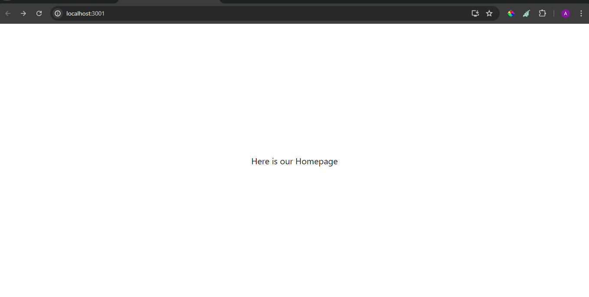
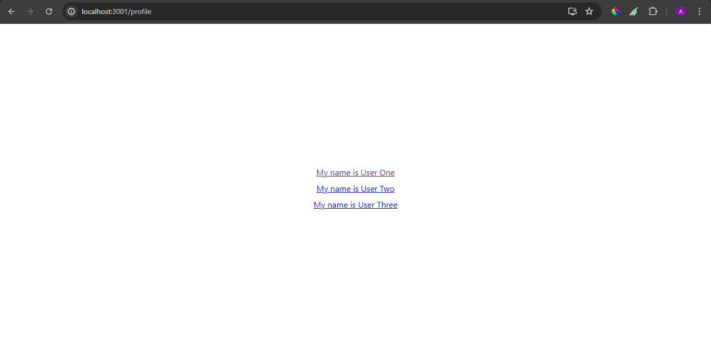
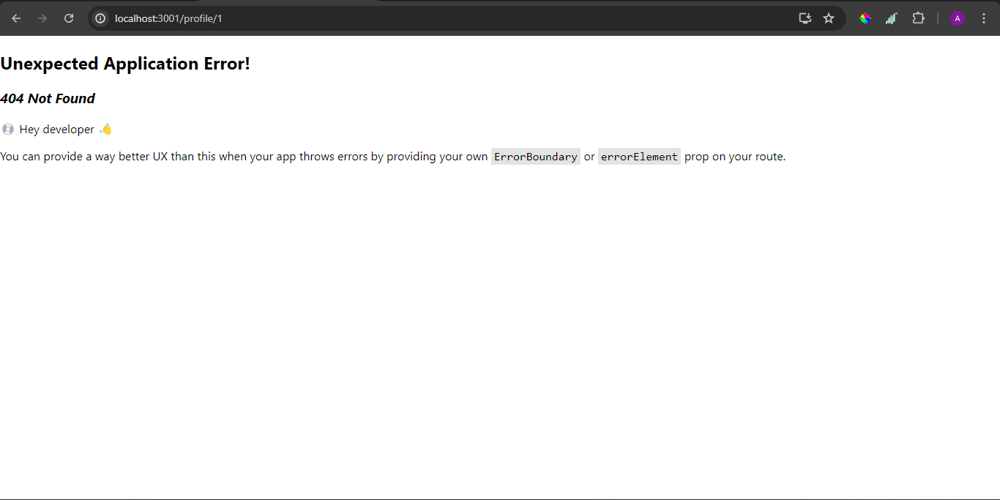
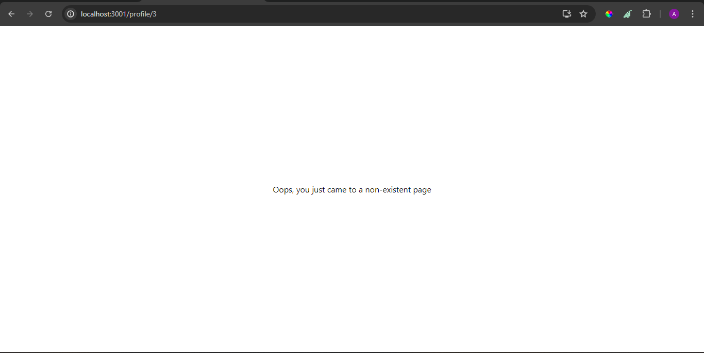
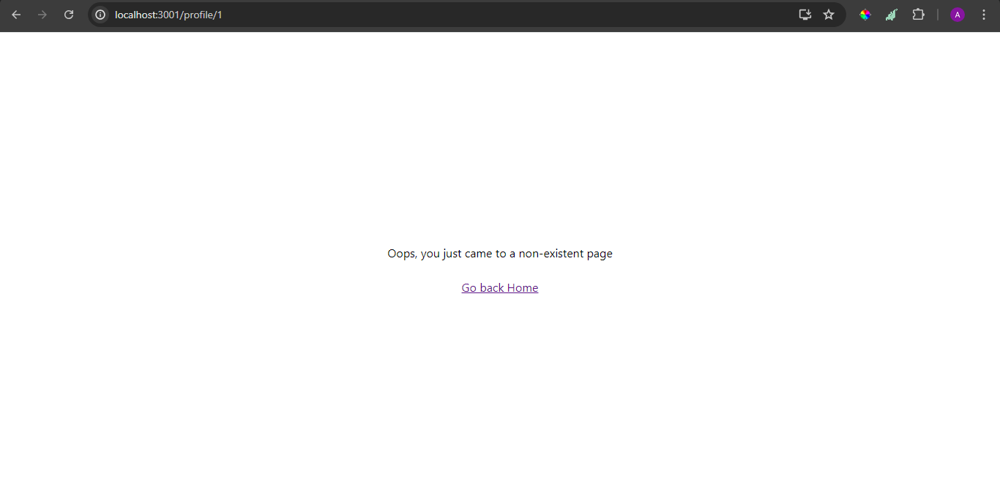
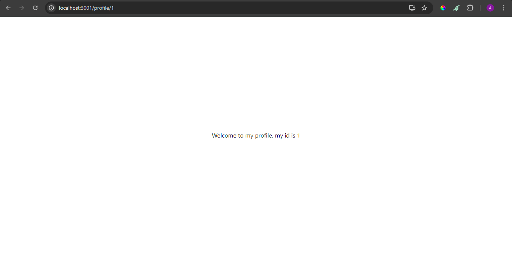
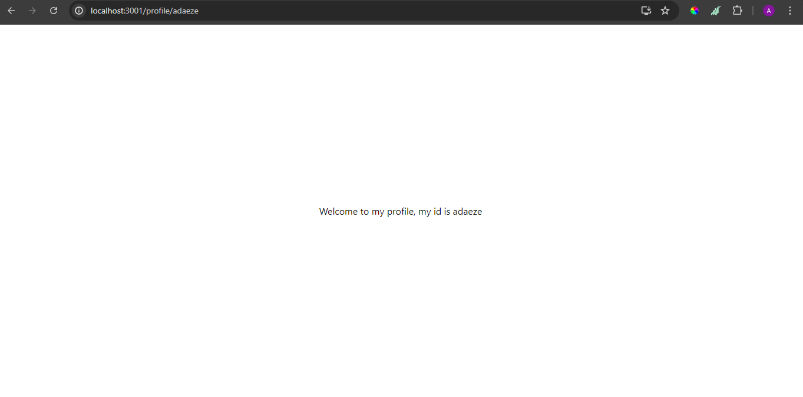

# WTF React minimalist tutorial: 9. React Router

WTF React tutorial helps newcomers get started with React quickly.

**WTF Academy Community**: [Official Website wtf.academy](https://wtf.academy) | [Discord](https://discord.gg/5akcruXrsk)

**Twitter**: [@WTFAcademy\_](https://twitter.com/WTFAcademy_) | Compiled by [@Mofasasi](https://twitter.com/mofasasi)

---

Typically in a web application, we need the users to be able to move from one page to the other. To achieve this in a React app, we need to use a library called React Router DOM.

# What is React Router DOM?

React Router DOM is a popular JavaScript library used for handling client-side routing in React applications. It allows you to create single-page applications (SPAs) with multiple routes, enabling users to navigate between different pages without reloading the entire page. Client-side routing is a technique where the browser handles the navigation between different pages within a web application. This approach is different from traditional server-side routing, where the server generates the HTML for each page and sends it to the browser. In client-side routing, the browser loads the initial HTML and then updates the content dynamically based on user interactions. If you will agree with me, I think that this technique is more effective. Let's dive right into it.

Before we get started, install the package using;

```javascript
npm i react-router-dom
```

First, you may need to create a PAGES folder in your src folder. You have to note that this is not a requirement, it is just a way of simplifying our codebase in case someone else has to work with it. Meaning we must have separated concerns into pages, components and so on.
For example, i go into my src folder and create a folder called pages. Then inside of the pages, i create a file which is going to house te components that i want to render on that particular page in my application.
For example, the order looks like src > pages > ProfilePage.

Then in your main file or index file (as you choose to call it), do the following;

1. Create a Browser Router and configure our first route. This will enable client side routing for our web app.

```javascript
import * as React from "react";
import * as ReactDOM from "react-dom/client";
import { createBrowserRouter, RouterProvider } from "react-router-dom";

import "./index.css";
import HomePage from "./pages/HomePage";
import ProfilePage from "./pages/ProfilePage";

const router = createBrowserRouter([
  {
    path: "/",
    element: <HomePage />,
  },
  {
    path: "/profile",
    element: <ProfilePage />, // the element here signifies what i wan to be displayed on the page, this is where the profile Page that we created comes in, right?
  },
]);

ReactDOM.createRoot(document.getElementById("root")).render(
  <React.StrictMode>
    <RouterProvider router={router} />
  </React.StrictMode>
);
```





By default, the slash signifies the homepage ('/') and all you have pass into the element is the component for homepage that you have created and profilepage, in the case of /profile.
The RouterProvider that we imported and wrapped inside of Our Render as shown below just implies that we have handed over the entry point into our application to React Router while using the router to define what component is rendered at each url.

```javascript
ReactDOM.createRoot(document.getElementById("root")).render(
  <React.StrictMode>
    <RouterProvider router={router} /> -- note this line, we have now
    surrendered our app's entry point to be controlled by react router DOM. cool
    right?
  </React.StrictMode>
);
```

Side note -- The RouterProvider is built using the Context API that we learnt in the last lesson.

With what we have done above, we have successful created a functioning routing system for our web application. You can go ahead and manually navigate to /profile by changing the URL from / to /profile and see how the profile page is going to show. You can add as many pages as you want, all you have to do is create new objects which take in the path and the element you want to render.

Now you would wonder, what if I manually type in a URL that does not exist e.g i go to /users. This is where errorElement comes in. Typically, you would want to create a 404 page that has been produced by the design team (if there's one, hahaha) and then put it in as the errorElement. All you need to do is change the router as in;

```javascript
const router = createBrowserRouter([
  {
    path: "/",
    element: <HomePage />,
    errorElement: <div>Oops, you just came to a non-existent page</div>,
  },
]);
```

Before the error element:


After adding the error element:


You will add your own component here, not a div (to separate concerns).You should note that it is usually advisable to add a button that leads the user to a page that exists on the platform, usually the homepage. Now to do that, we use LINK from the same library, react router.
You might be wondering, why not use the html anchor tag (a), the reason is Link does not perform a full page refresh when clicked, compared to anchor tag. You can try both and see that when you use the anchor tag, the page refreshes and then requests the whole html and javascript all over again. Here's how to use Link.

```javascript
import { Link } from "react-router-dom";

const router = createBrowserRouter([
  {
    path: "/",
    element: <HomePage />,
    errorElement: (
      <div className="container">
        <p>Oops, you just came to a non-existent page</p>
        <Link to="/">Go back Home</Link>
      </div>
    ),
  },
]);
```



By clicking on that, the user gets to be taken to the homepage or well, the specified page in the "to" attribute. The TO is just to specific where you want the user to be directed to. It works just like href in anchor tag.

# Dynamic Paths

There are a few times when you may want to render the same view but for different sets of data. A classic example is a profile page which shows a list of users and then by clicking on a particular user, you get to go to another page and using the user's information, you fetch the user's data. How do you do this? How do you know which user's data to fetch per time? This is where the idea of dynamic paths come in.
Dynamic paths in React Router allow you to create routes that can match any value in a specific segment of the URL. This is achieved by using a colon (:) in the path pattern to indicate a dynamic segment.
Let us take an example;

```javascript
import { Link } from "react-router-dom";

function ProfilePage() {
  const users = [
    {
      id: 1,
      name: "User One",
    },
    {
      id: 2,
      name: "User Two",
    },
    {
      id: 3,
      name: "User Three",
    },
  ];

  return (
    <div className="container">
      {users?.map((user) => (
        <Link to={`/profile/${user?.id}`} key={user.id}>
          My name is {user?.name}
        </Link>
      ))}
    </div>
  );
}
export default ProfilePage;
```

Then in main.jsx, we have to create a new route in router which is going to house each particular user's profile.

```javascript
import UserDetails from './pages/UserDetails'
const router = createBrowserRouter([
    //other paths go here
  {
    path: "/profile/:userId", //note that userId here could be anything at all, you could call it profileId, or even just id. just anything that helps you explain what the nested path signifies.
    element: <UserDetails />, // the page you have linked the list to.
  },
```



With this, clicking on any user's profile and getting our data just got a little bit easier. Reason being that to fetch a single user's data, we mostly would need to pass in an id to an endpoint that fetches the particular user's profile. With the dynamic path implementation we just did, we can get the id on the page without any hassle.
To do this, you make use of the useParams hook; Here's how to do that;

```javascript
//the page that shows detailed user's information and is being linked to.
import { useParams } from "react-router-dom";
function UserDetails() {
  const params = useParams();
  console.log("params are", params); // do this to see what params return to us
  return (
    <div className="container">
      Welcome to my profile, my id is {params?.userId}
    </div>
  );
}
export default UserDetails;
```

So, for every path that you try to match the page to, it's going to be available. E.g if you go to /profile/28, it is available, if you go to /profile/avshaudgadhadagdgadgad, trust me that too is available. UseParams return the id to us and with that we can perform a fetch action which is a get request to an endpoint hosted somewhere as shown below. This could be done in a useEffect but of course, you can use an external library like react query to make life easier for yourself.

Look at the URL here and see how it matched what was rendered on the UI;


```javascript
import React, { useState, useEffect } from "react";
import { userParams } from "react-router-dom";
import axios from "axios";

function UserDetails() {
  const { userId } = useParams(); // i destructed userId off of useParams here which is the same thing as having const params = useParams(), then using it as params?.userId
  const [user, setUser] = useState(null);
  const [loading, setLoading] = useState(false);

  useEffect(() => {
    const fetchUser = async () => {
      setLoading(true);
      try {
        const response = await axios.get(
          `https://jsonplaceholder.typicode.com/users/${userId}`
        );
        setUser(response.data);
      } catch (error) {
        console.error(error);
      } finally {
        setLoading(false);
      }
    };

    fetchUser();
  }, [userId]);

  return (
    <div>
      {loading ? (
        <p>Loading...</p>
      ) : (
        <div>
          <h2>{user?.name}</h2>
        </div>
      )}
    </div>
  );
}
export default UserDetails;
```

This is a typical use case of the dynamic paths in a web application.

# Summary

In this lesson, we learnt how to create routes, navigate to such routes and also how to navigate to dynamic paths. We also touched on why Link is preferred to the anchor tag and lastly, how to use useParams to get an id to fetch data from an endpoint.

# Exercise

Replicate these examples without taking a look at the codebase provided. Go ahead to implement another use case for this, take for instance a transactions page that lists various transactions and by clicking on one of them, you get to go to another page where all the details of such transaction is listed. It is going to be fun, trust me.
