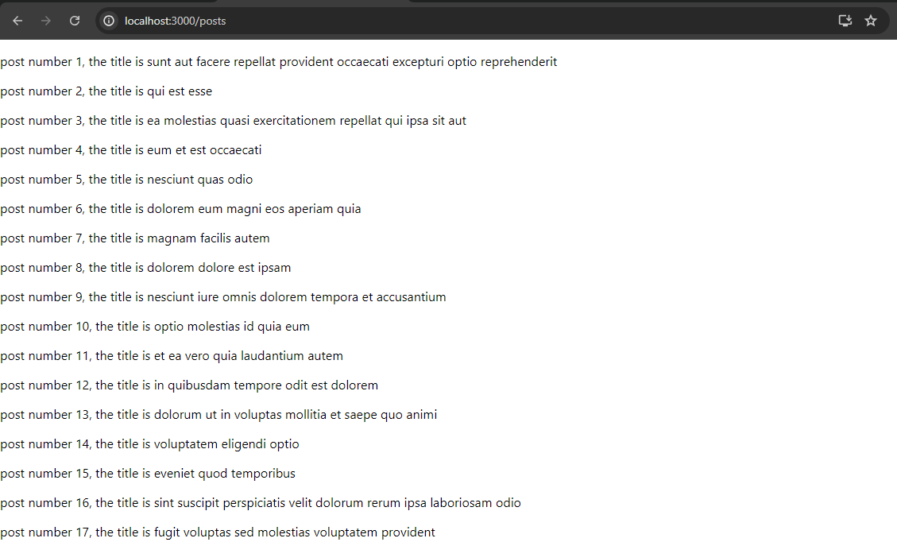

# WTF React minimalist tutorial: 11. Data Fetching

WTF React tutorial helps newcomers get started with React quickly.

**WTF Academy Community**: [Official Website wtf.academy](https://wtf.academy) | [Discord](https://discord.gg/5akcruXrsk)

**Twitter**: [@WTFAcademy\_](https://twitter.com/WTFAcademy_) | Compiled by [@Mofasasi](https://twitter.com/mofasasi)

---

Typically, the data rendered on the frontend to users are gotten from the database somewhere, but because users cannot directly access the database, the data are then sent over the wire from various endpoints that have been provided on the backend. In Javascript, we use the FETCH API to make these requests.

## What is the fetch API?

The Fetch API is a modern interface for making HTTP requests in web browsers. It provides a more powerful and flexible way to send and receive data compared to older methods like XMLHttpRequest. This API allows us to easily make network requests, handle responses, and deal with data in various formats The fetch API is in-built and therefore natively supported in modern browsers without the need for any external library. Meaning that we can, using just the fetch API, get our data without having to rely on external libraries such as axios. The Fetch API is commonly used for interacting with RESTful APIs, retrieving resources, and sending data to servers.
Fetch uses Promises, making it easier to handle asynchronous operations and chain multiple requests. It is also worthy of note that the syntax is quite easy and straightforward.

Let's take a look at a basic example of how the fetch API's syntax in use.

```javascript
fetch("https://jsonplaceholder.typicode.com/posts")
  .then((response) => response.json())
  .then((data) => console.log(data))
  .catch((error) => console.error("Error:", error));
```

What we did using the above code is that, we are calling the json placeholder's posts endpoint (which could be any endpoint really) and we then expect to get a response from the endpoint which we then converted into JSON in the second line. We then went on to log our data into the console to see what it looks like so we can then proceed to render it on the UI.

Here's a full example of the fetch api, combined with useEffect to fetch data from an endpoint when the page mounts and then render the data on the frontend.

```javascript
import { useState, useEffect } from "react";

const Posts = () => {
  const [data, setData] = useState(null);
  const [loading, setLoading] = useState(true);
  const [error, setError] = useState(null);

  useEffect(() => {
    fetch("https://jsonplaceholder.typicode.com/posts")
      .then((response) => {
        if (!response.ok) {
          throw new Error("Network response was not ok");
        }
        return response.json();
      })
      .then((data) => {
        setData(data);
        setLoading(false);
      })
      .catch((error) => {
        setError(error.message);
        setLoading(false);
      });
  }, []);

  if (loading) return <div>Loading...</div>;
  if (error) return <div>Error: {error}</div>;
  return (
    <div>
      {data?.map((post) => {
        return (
          <p key={post.id}>
            post number {post.id}, the title is {post.title}
          </p>
        );
      })}
    </div>
  );
};

export default Posts;
```



The above code fetches data from the endpoint and then maps over each of the post object in the posts array to return a paragraph showing the ID and the title of such post.
Notice how that I put an attribute KEY on the paragraph tag that I returned? The reasons are not far-fetched, they include:

1. Efficient reconciliation: React uses a process called reconciliation to update the UI when the state of an application changes. By providing unique keys, React can quickly identify which elements have changed and only update those, rather than re-rendering the entire list. This leads to improved performance and resource management.
2. Preventing unexpected behavior: Without unique keys, React may struggle to correctly update elements, which can result in unpredictable UI behavior. For instance, if an item is removed from a list, React might not properly adjust the remaining items, leading to display issues. Unique keys help maintain the integrity of the list during updates.
3. Unique among siblings: Keys must be unique only among their immediate siblings. This means that while the same key can be reused in different lists, each key within a single list must be distinct to avoid conflicts during updates. For example, we cannot have two different objects in that array with the same ID (because we are using ID as the key in his case), we are going to get a warning in the console saying "Warning: Encountered two children with the same key, `KEY_VALUE`. Keys should be unique so that components maintain their identity across updates.", OR 'Warning: Each child in a list should have a unique "key" prop.
   ' if we didn't pass the key prop at all.
   All of these is just to emphasize the importance of passing the key prop everytime you map over items in an array.

The Fetch API has met our basic need in this case. However, fetch doesn't automatically transform JSON data meaning everytime we use the API, we have to first convert our response to JSON before going ahead to use it. This can be quite an hassle in the long-run as we do not want to be duplicating codes unnecessarily.
Also, it doesn't have built-in support for request cancellation, which has posed challenges for us needing to abort ongoing requests. This limitation stemmed from the nature of JavaScript Promises, as stated earlier that the fetch API uses Promises, which do not support cancellation.
In addition to the above, error handling is a mess when you are using the fetch API. it is always verbose, as network errors don't reject the promise, trust me you don't want to go down that path of having to handle a lot of cases that could occur regarding errors in your code.
Thankfully, there's a library that perfectly solves the limitations that face the Fetch API. It is called AXIOS.

## What is Axios?

Axios is a popular JavaScript library used for making HTTP requests from both the browser and Node.js. It has been designed to be easy to use and provides several advantages over built-in methods like the Fetch API. It is Promise-based, just like the Fetch API, which makes handling asynchronous operations straightforward. It has a simple and intuitive API that's easy for beginners to understand. More importantly, axios automatically transforms JSON data, so you don't need to manually parse responses.
One of the most important use of axios or we could call it a feature is "the interceptors". These allow you to modify requests or responses before they're handled by then or catch. For example, if a request shows a response code of 401, meaning that the user is not authorized, every other request that has been lined up to follow that will be canceled by the interceptor.

## Usage

To use axios, you first have to install it, as it is an external library. This is done by running the following in the terminal;

```javascript
npm i axios
```

The basic syntax looks like;

```javascript
import axios from "axios";

axios
  .get("https://api.example.com/data")
  .then((response) => {
    console.log(response.data);
  })
  .catch((error) => {
    console.error("Error:", error);
  });
```

Such that, if we replace the former Posts page with this following set of code, we are going to have the same thing;

```javascript
import { useState, useEffect } from "react";
import axios from "axios";

const Posts = () => {
  const [data, setData] = useState(null);
  const [loading, setLoading] = useState(false);
  const [error, setError] = useState(null);

  useEffect(() => {
    axios
      .get("https://jsonplaceholder.typicode.com/posts")
      .then((response) => {
        console.log(response.data);
        setData(response.data);
      })
      .catch((error) => {
        console.error("Error:", error);
        setError(error);
      });
    setLoading(false);
  }, []);

  if (loading) return <div>Loading...</div>;
  if (error) return <div>Error: {error}</div>;
  return (
    <div>
      {data?.map((post) => {
        return (
          <p key={post.id}>
            post number {post.id}, the title is {post.title}
          </p>
        );
      })}
    </div>
  );
};

export default Posts;
```

The difference then is that this is more efficient than the one we had earlier. Even though this can also be optimized to perform better, which brings us to using instances.
Axios instances are custom configurations of the Axios HTTP client that allow us to create reusable settings for making HTTP requests. It enhances code maintainability and consistency, especially when interacting with multiple APIs or endpoints that require specific configurations.
For example: you can create a file called api.js and then have an axios instance in there as follows:

```javascript
import axios from "axios";

// Instance creation happens here
export const api = axios.create({
  baseURL: "https://jsonplaceholder.typicode.com",
});

// Interceptor is here
api.interceptors.request.use(
  (config) => {
    console.log("Request sent:", config.url);
    // You could add headers, tokens, etc. here depending on what you need e.g.
    config.headers.Authorization = `Bearer ${token}`; // the token is to be passed into this from wherever you get your token from. otherwise, you get an error
    return config;
  },
  (error) => {
    console.error("Request error:", error);
    return Promise.reject(error);
  }
);

// Response interceptor
api.interceptors.response.use(
  (response) => {
    console.log("Response received:", response.config.url);
    return response;
  },
  (error) => {
    console.error("Response error:", error);
    return Promise.reject(error);
  }
);
```

We can then have our posts page to look like we are calling the api here to get some data from the baseURL provided here. Typically, the baseURL is going to be the server that you hit everytime you send a request and then all you have to do is pass the particular route you want to hit as follows:

```javascript
import { useState, useEffect } from "react";
import { api } from "../api";

const Posts = () => {
  const [data, setData] = useState(null);
  const [loading, setLoading] = useState(true);
  const [error, setError] = useState(null);

  useEffect(() => {
    api
      .get("/posts") // we want to go to 'https://jsonplaceholder.typicode.com/posts' but because we have set jsonplaceholder.typicode as our base URL, the instance only then find the "/POSTS" route for this request.
      .then((response) => {
        setData(response.data);
      })
      .catch((error) => {
        setError(error.message);
      });

    setLoading(false);
  }, []);

  if (loading) return <div>Loading...</div>;
  if (error) return <div>Error: {error}</div>;
  return (
    <div>
      {data?.map((post) => (
        <p key={post.id}>
          post number {post.id}, the title is {post.title}
        </p>
      ))}
    </div>
  );
};

export default Posts;
```

This way, we have a resuable api to call without having to rewrite codes that we could do away with. This makes life way easier for us and makes us write resuable and optimized code which can be maintained properly in the long-run.

## Summary

While Fetch API is a powerful built-in tool, axios provides several advantages that can make development easier and more efficient, especially in larger applications. Its features like automatic transforms, better error handling, and interceptors can lead to cleaner and more maintainable code.

## Exercise

Understand the above codes and the reason why we are using instances, then go ahead to get your hand dirty by making request to various endpoints that have the same baseURL on different pages in your application. You should go as far as designing the webpage to look very beautiful by adding a loading spinner and maybe a toast that nudges the user in case an error occurs rather than just showing it as texts on the screen.
Also, and this is an advice, as you continue to develop your skills, experiment with both Fetch and Axios in various scenarios. This hands-on experience will deepen your understanding and help you leverage these tools effectively in your future work.
