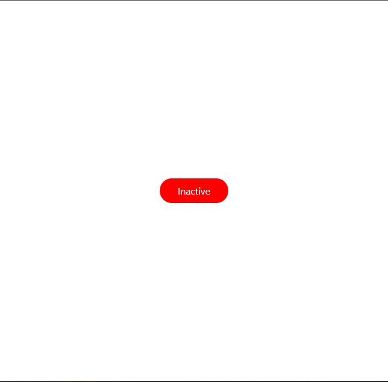
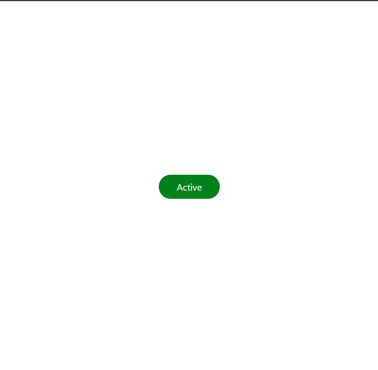

# WTF React minimalist tutorial: 12. Conditional Rendering

WTF React tutorial helps newcomers get started with React quickly.

**WTF Academy Community**: [Official Website wtf.academy](https://wtf.academy) | [Discord](https://discord.gg/5akcruXrsk)

**Twitter**: [@WTFAcademy\_](https://twitter.com/WTFAcademy_) | Compiled by [@mofasasi](https://twitter.com/mofasasi)

---

# Conditional Rendering

Conditional rendering is a technique that allows you to display different content based on certain conditions. It's similar to using if-else statements in regular JavaScript, but applied within your JSX. There are various methods of conditionally rendering items on your User interface and they include;

# 1. Using the Ternary Operator

The ternary operator is another way to write simple if-else statements. Here's how it works:

```javascript
const Greeting = () => {
  const isLoggedIn = true;

  return (
    <div>{isLoggedIn ? <h1>Welcome back!</h1> : <h1>Please sign in.</h1>}</div>
  );
};

export default Greeting;
```

In this example, we are checking that if isLoggedIn is true, display "Welcome back!", otherwise show "Please sign in."
The logic is that, the set of element that follows the "?" is what is to be shown when the condition is true, while the element that follows ":" is to be shown whenever the condition is false. So, read the above statement as if isLoggedIn is TRUE (?), show "Welcome back", but if it is false (":"), show "Please sign in".

# 2. Using Logical AND (&&) Operator

For simpler conditions where you just want to render SOMETHING or NOTHING -- meaning you want to render an element or else, don't render any element in the space provided, then you use the && operator. Here's how it looks;

```javascript
const Notification = () => {
  const hasNewMessages = true;
  return <div>{hasNewMessages && <p>You have new messages!</p>}</div>;
};

export default Notification;
```

This will only render the paragraph if hasNewMessages is true, otherwise there will be nothing to show on the notification screen.

# 3. Conditional Rendering with State

Let's combine what we learned about state with conditional rendering:

```javascript
import { useState } from "react";
import "./App.css";

const ToggleButton = () => {
  const [isOn, setIsOn] = useState(false);

  const toggle = () => {
    setIsOn(!isOn);
  };

  return (
    <div className="container">
      <button onClick={toggle}>
        {isOn ? "Turn Off" : "Turn On"} the light
      </button>
      {isOn && <p>The light is currently ON!</p>}
    </div>
  );
};

export default ToggleButton;
```

 

In this example, we used state to keep track of whether the button is on or off, and then went on to conditionally render both the button text and an additional message.

Another perfect use case for conditional rendering is when you are trying to fetch some sets of data from an API endpoint, you have to cater for the loading state, error state and then the original component to render if the data come back successfully to the user. Conditional rendering can also be used in classNames such that based on some condition, you can choose to apply a className or not. Here's an example of that;

```javascript
import React, { useState } from "react";
const ConditionalClassExample = () => {
  const [isActive, setIsActive] = useState(false);

  const toggleActive = () => {
    setIsActive(!isActive);
  };

  return (
    <div className="container">
      <p
        className={`default ${isActive ? " active_bg" : "inactive_bg"}`}
        onClick={toggleActive}
      >
        {isActive ? "Active" : "Inactive"}
      </p>
    </div>
  );
};

export default ConditionalClassExample;
```

 

In the above example, the className "default" serves as a foundation, always present regardless of the the "isActive" state. It is the base styling that remains constant.The conditional part ${isActive ? "active_bg" : "inactive_bg"} acts as a dynamic modifier. It evaluates the isActive state and applies either "active_bg" or "inactive_bg" accordingly. This conditional class complements the base "default" class, allowing us to apply state-specific styling.

# Summary

In this lecture, we learned about different methods of conditional rendering in React, including the ternary operator, logical AND operator, as well as how to combine conditional rendering with state.
Please note that it may not be as basic as this in your project (starting with the exercise), such that after fetching your data from an endpoint for instance, you have to check for if a condition is true or false and then based on that, render your components conditionally.

# Exercise

Create a component that displays a list of items. Use conditional rendering to show a message "The list is empty" when there are no items, and show the actual list when there are items. Use the useState hook to manage the list of items.
