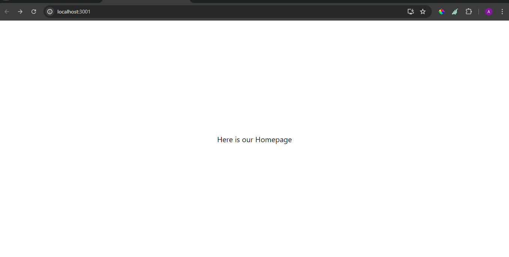
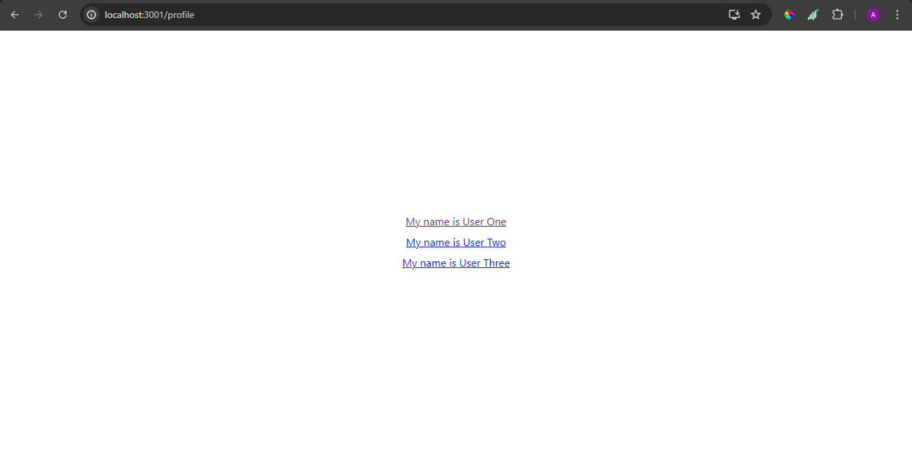
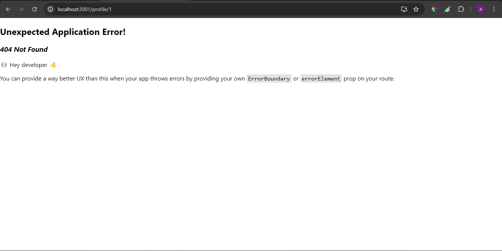
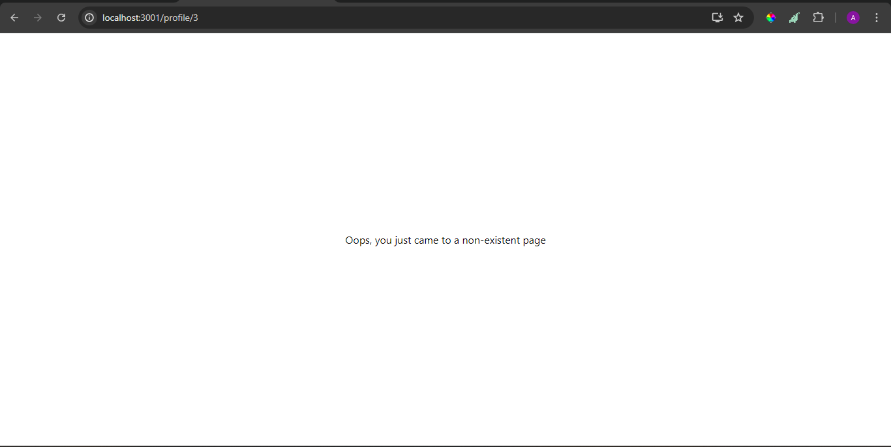
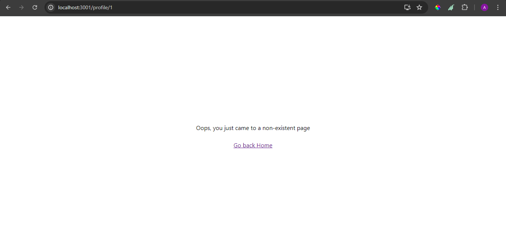
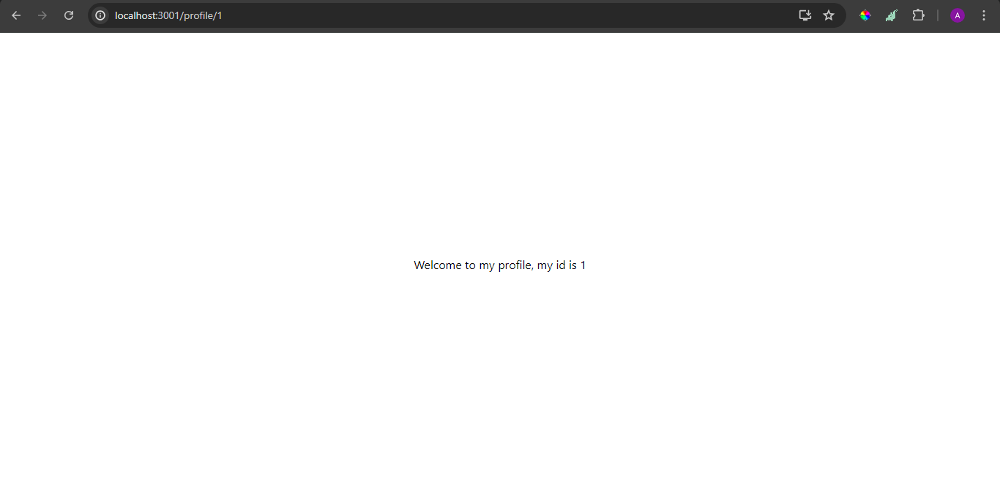
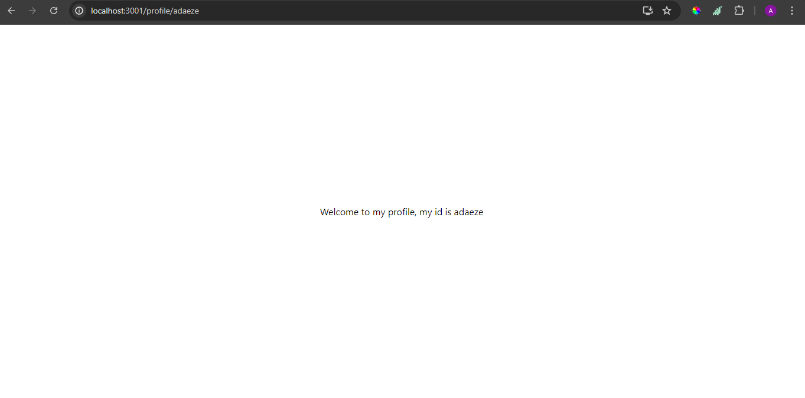

# WTF React minimalist tutorial: 12. React Router

WTF React tutorial helps newcomers get started with React quickly.

**WTF Academy Community**: [Official Website wtf.academy](https://wtf.academy) | [Discord](https://discord.gg/5akcruXrsk)

**Twitter**: [@WTFAcademy\_](https://twitter.com/WTFAcademy_) | Compiled by [@Mofasasi](https://twitter.com/mofasasi)

---

React Router DOM is a widely-used JavaScript library for managing client-side routing in React applications. It enables the creation of single-page applications (SPAs) with multiple routes, allowing users to navigate between different pages without reloading the entire page. Unlike traditional server-side routing, where the server sends new HTML for each page, client-side routing keeps the initial HTML loaded and updates the content dynamically based on user actions. This method is generally more efficient for modern web applications.

To get started, first install the package using:

```javascript
npm i react-router-dom
```

First, create a `PAGES` folder in your `src` directory. This is not mandatory but helps in organizing your codebase, especially for collaborative projects. The idea is to separate concerns into different directories such as `pages`, `components`, etc.

For example, navigate to your `src` folder and create a folder named `pages`. Inside this folder, create files for the components that will be rendered on each page of your application. For instance, the structure might be `src > pages > ProfilePage`.

In your main file or `index` file (as you prefer to name it), follow these steps:

1. Set up a `BrowserRouter` and configure your initial route. This enables client-side routing for your application.

```javascript
import * as React from "react";
import * as ReactDOM from "react-dom/client";
import { createBrowserRouter, RouterProvider } from "react-router-dom";

import "./index.css";
import HomePage from "./pages/HomePage";
import ProfilePage from "./pages/ProfilePage";

const router = createBrowserRouter([
  {
    path: "/",
    element: <HomePage />,
  },
  {
    path: "/profile",
    element: <ProfilePage />, // the element here signifies what I want to be displayed on the page, this is where the profile Page that we created comes in, right?
  },
]);

ReactDOM.createRoot(document.getElementById("root")).render(
  <React.StrictMode>
    <RouterProvider router={router} />
  </React.StrictMode>
);
```





By default, the slash (`/`) represents the homepage, and you provide the components for different routes, such as the homepage and `ProfilePage` (for `/profile`).

The `RouterProvider`, which we imported and wrapped inside our `Render`, indicates that we have delegated the routing logic to React Router. This setup allows React Router to determine which component should be rendered for each URL.

```javascript
ReactDOM.createRoot(document.getElementById("root")).render(
  <React.StrictMode>
    <RouterProvider router={router} /> -- note this line, we have now
    surrendered our app's entry point to be controlled by react router DOM. cool
    right?
  </React.StrictMode>
);
```

The `RouterProvider` is built using the Context API that we discussed in the last lesson.

With this setup, you've successfully implemented a routing system for your web application. You can manually navigate to `/profile` by changing the URL and see the profile page. You can add more pages by creating new routes with their respective paths and components.

If you manually enter a URL that doesn't exist, such as `/users`, this is where the `errorElement` comes into play. You should create a 404 page (if designed) and specify it as the `errorElement` in the router configuration. Update your router setup like this:

```javascript
const router = createBrowserRouter([
  {
    path: "/",
    element: <HomePage />,
    errorElement: <div>Oops, you just came to a non-existent page</div>,
  },
]);
```

Before the error element:


After adding the error element:


You will add your own component here, not a `div` (to separate concerns). It's also advisable to include a button that directs users to a page that exists on the platform, typically the homepage. To achieve this, we use `Link` from the same library, React Router.

You might wonder why not use the HTML anchor tag (`<a>`). The reason is that `Link` does not trigger a full page refresh when clicked, unlike the anchor tag. Using `Link` ensures that only the necessary content is updated without reloading the entire page. Here's how to use `Link`:

```javascript
import { Link } from "react-router-dom";

const router = createBrowserRouter([
  {
    path: "/",
    element: <HomePage />,
    errorElement: (
      <div className="container">
        <p>Oops, you just came to a non-existent page</p>
        <Link to="/">Go back Home</Link>
      </div>
    ),
  },
]);
```



By clicking on that, the user will be redirected to the homepage or the specified page in the `to` attribute. The `to` attribute functions similarly to `href` in the anchor tag.

# Dynamic Paths

Sometimes, you may need to render the same view for different data sets. For instance, a profile page might display a list of users, and clicking on a user takes you to a detailed view of that user's information. To achieve this, you use dynamic paths.

Dynamic paths in React Router let you create routes that match variable values in a specific segment of the URL. This is done by using a colon (`:`) in the path pattern to represent a dynamic segment. 

Here's an example:

```javascript
import { Link } from "react-router-dom";

function ProfilePage() {
  const users = [
    {
      id: 1,
      name: "User One",
    },
    {
      id: 2,
      name: "User Two",
    },
    {
      id: 3,
      name: "User Three",
    },
  ];

  return (
    <div className="container">
      {users?.map((user) => (
        <Link to={`/profile/${user?.id}`} key={user.id}>
          My name is {user?.name}
        </Link>
      ))}
    </div>
  );
}
export default ProfilePage;
```

In `main.jsx`, you need to create a new route in the router to handle each user's profile. This route will use a dynamic path to match individual user profiles based on the user ID.

```javascript
import UserDetails from './pages/UserDetails'
const router = createBrowserRouter([
    //other paths go here
  {
    path: "/profile/:userId", //note that userId here could be anything at all, you could call it profileId, or even just id. just anything that helps you explain what the nested path signifies.
    element: <UserDetails />, // the page you have linked the list to.
  },
```



With this setup, accessing a user's profile and fetching data specific to that user becomes more straightforward. You can now retrieve the `id` from the URL directly using the `useParams` hook, which simplifies fetching and displaying user-specific data based on the dynamic URL segment.

```javascript
//the page that shows detailed user's information and is being linked to.
import { useParams } from "react-router-dom";
function UserDetails() {
  const params = useParams();
  console.log("params are", params); // do this to see what params return to us
  return (
    <div className="container">
      Welcome to my profile, my id is {params?.userId}
    </div>
  );
}
export default UserDetails;
```

For every path you try to match, the route will be available. For example, navigating to `/profile/28` or `/profile/avshaudgadhadagdgadgad` will both be valid. The `useParams` hook returns the `id`, which allows you to perform a fetch action, such as a GET request to an endpoint. This can be done using `useEffect`, or you can use an external library like React Query to simplify data fetching and management.

Look at the URL here and see how it matched what was rendered on the UI;  



```javascript
import React, { useState, useEffect } from "react";
import { userParams } from "react-router-dom";
import axios from "axios";

function UserDetails() {
  const { userId } = useParams(); // i destructed userId off of useParams here which is the same thing as having const params = useParams(), then using it as params?.userId
  const [user, setUser] = useState(null);
  const [loading, setLoading] = useState(false);

  useEffect(() => {
    const fetchUser = async () => {
      setLoading(true);
      try {
        const response = await axios.get(
          `https://jsonplaceholder.typicode.com/users/${userId}`
        );
        setUser(response.data);
      } catch (error) {
        console.error(error);
      } finally {
        setLoading(false);
      }
    };

    fetchUser();
  }, [userId]);

  return (
    <div>
      {loading ? (
        <p>Loading...</p>
      ) : (
        <div>
          <h2>{user?.name}</h2>
        </div>
      )}
    </div>
  );
}
export default UserDetails;
```

This is a typical use case for dynamic paths in a web application.

# Summary

In this lesson, we covered how to create routes, navigate between them, and handle dynamic paths. We discussed why `Link` is preferred over the anchor tag and how to use `useParams` to fetch data based on dynamic segments in the URL.

# Exercise

Replicate these examples without referring to the codebase provided. Implement a transactions page that lists various transactions and, upon clicking a transaction, redirects to a page displaying the details of the selected transaction. It will be a fun exercise, trust me.
